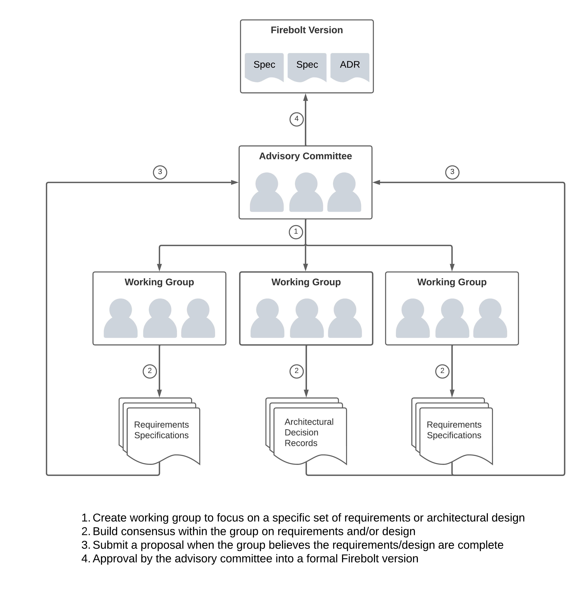
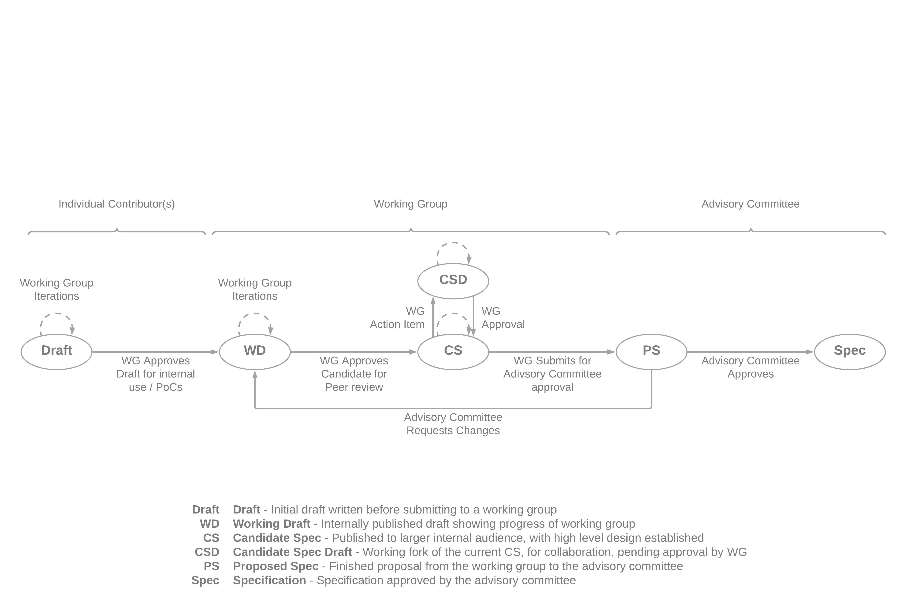
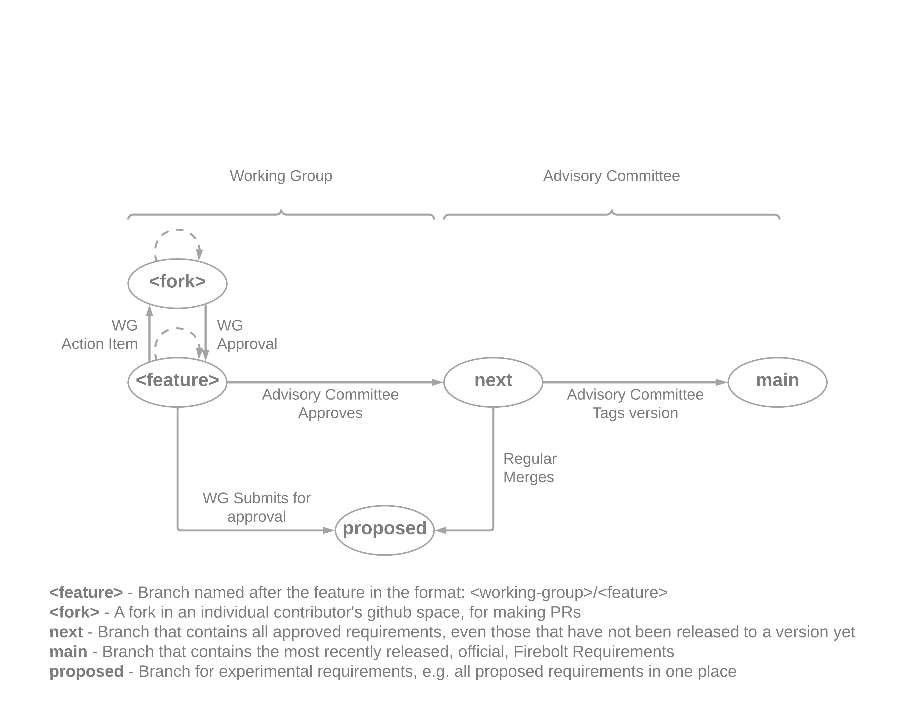

# Requirements Governance
This document outlines the governance model for the Firebolt&reg; Open-Source  
Project, including the structure of an Advisory Board and Working Groups, as  
well as the process used to codify Requirements Specifications and  
Architectural Decision Records.  

## 1. Overview
The Firebolt Open-Source Project is governed by an Advisory Board that creates  
and delegates work to Working Groups, which then create proposals for  
Requirements Specifications and Architectural Decision Records.  

  

## 2. Table of Contents
- [1. Overview](#1-overview)
- [2. Table of Contents](#2-table-of-contents)
- [3. Goals](#3-goals)
- [4. Governance](#4-governance)
  - [4.1. Scope](#41-scope)
  - [4.2. Firebolt Version](#42-firebolt-version)
  - [4.3. Advisory Board](#43-advisory-board)
  - [4.4. Advisory Board Members](#44-advisory-board-members)
  - [4.5. Working Group](#45-working-group)
  - [4.6. Requirements Specification](#46-requirements-specification)
  - [4.7. Architectural Decision Record](#47-architectural-decision-record)
  - [4.8. Approval Stages](#48-approval-stages)
    - [4.8.1. Draft](#481-draft)
    - [4.8.2. Working Draft](#482-working-draft)
    - [4.8.3. Candidate Specification](#483-candidate-specification)
    - [4.8.4. Candidate Specification Draft](#484-candidate-specification-draft)
    - [4.8.5. Proposed Specification](#485-proposed-specification)
    - [4.8.6. Specification](#486-specification)
  - [4.9. Requirements Repository](#49-requirements-repository)
  - [4.10. Requirements Repository Branching](#410-requirements-repository-branching)
  - [4.11. Sanctioned Forks](#411-sanctioned-forks)
  - [4.12. Release Versions](#412-release-versions)

## 3. Goals
The goal of the Firebolt Open-Source Project is to provide a  
Distributor-configurable set of integration APIs and functional requirements  
for those APIs so that Apps can integrate with the APIs once and run their  
app on every Firebolt platform (regardless of distributor) consistently.  

Specifically, Firebolt provides:  

 - Write Apps once, run on all Firebolt distributors
 - Discovery and launching of Apps
 - Detection of, and access control for, Firebolt APIs and features
 - Discovery of app content and metrics once discovered
 - Platform integration APIs, (e.g. captions, media info, etc.)
 - Device and account management
 - Integration APIs for broader eco-system integrations
(e.g. user experience, advertising, voice, etc.)  

While enabling Distributors to:  

 - Provide differentiating Discovery and Settings experiences
 - Configure Firebolt features to meet their business needs
 - Configure Firebolt user privacy & opt-in settings
 - Decide which set of optional Firebolt features to support
 - Negotiate access to features and APIs with each app

## 4. Governance
The Firebolt Open-Source Project is governed by an Advisory Board. The purpose  
of the Advisory Board is to ensure that each major, minor, and patch version  
of the Firebolt Requirements is aligned with the goals of the Firebolt  
Open-Source Project.  

The Firebolt Requirements are the collection of all Requirements Specifications 
  and all Architectural Decision Records that are ratified by the Advisory  
Board (and contained in this repository).  
	
### 4.1. Scope
This document describes the governance model for the following components:  

 - Firebolt RPC APIs & SDKs
 - Firebolt Media Pipeline (aka Rialto)
 - Firebolt API Reference Implementation (Ripple)

### 4.2. Firebolt Version
A Firebolt Version is a snapshot of the Firebolt Requirements that has been  
ratified as an official release of the requirements. Note that the  
requirements are decoupled from any implementation of those requirements, and 
  iterations to the requirements will occur with input from any teams  
implementing them.  

Firebolt Versions **MUST** follow Semantic Versioning.  

### 4.3. Advisory Board
The Advisory Board oversees all aspects of Firebolt Requirements Governance.  

Advisory Board decisions should aim to be unanimous whenever possible, but in  
cases of deadlock, may be decided by simple majority.  

The Advisory Board is responsible for:  

 - Prioritization of Working Groups needed
 - Creation of balanced Working Groups with relevant subject matter experts
 - Solicitation of peer review by SMEs that are not from the working group
 - Ratification of requirements into the official Firebolt Requirements
 - Determination of when to tag a new minor version release of the Firebolt Requirements
 - Determination of when to tag a new major version release of the Firebolt Requirements
 - Determination of when a sanctioned fork is warranted

### 4.4. Advisory Board Members
The Firebolt Advisory Board is currently being formed and will be published  
soon.  

Contact the `rdkcentral/firebolt-apis` maintainer, [Jeremy  
LaCivita](https://github.com/jlacivita), to submit proposals to the Advisory  
Board.  

### 4.5. Working Group
Working Groups build consensus on requirements for Firebolt features or  
architectural solutions. They should ideally be three to five individuals  
spanning technical and product experts. Further recommendations on working  
group composition are left to the Advisory Board.  

As new features are prioritized, Working Groups should be formed to gather and  
document requirements for those features. Working groups may be self-forming  
or selected by the Advisory Board, but all working groups must have their  
membership reviewed and approved by the board to ensure that they are well  
balanced.  

The Advisory Board **MAY** appoint a Working Group Chair or instruct the  
Working Group to select a chair amongst themselves.  

The Working Group Chair is responsible for driving consensus and reporting back 
  to the Advisory Board  

### 4.6. Requirements Specification
A Requirements Specification includes all details necessary for multiple,  
disassociated teams to build a consistent implementation of a feature,  
including API signatures, validation, and functionality, as well as  
functional and behavioral requirements of the feature that are not directly  
exposed by an API.  

Requirements and APIs may be targeted towards traditional 3rd party apps, as  
well as more foundational 1st party apps.  

The level of detail in an acceptable Requirements Specification should be such  
that any App should run consistently on any implementation of the feature  
that is based on the Specification.  

Requirements Specifications are written using the [IETF Best Common Practice  
14](https://www.rfc-editor.org/rfc/rfc2119.txt) and should include the  
following at the end of the Overview:  

The key words "**MUST**", "**MUST NOT**", "**REQUIRED**", "**SHALL**", "**SHALL 
  NOT**", "**SHOULD**", "**SHOULD NOT**", "**RECOMMENDED**", "**NOT  
RECOMMENDED**", "**MAY**", and "**OPTIONAL**" in this document are to be  
interpreted as described in [BCP  
14](https://www.rfc-editor.org/rfc/rfc2119.txt) [RFC2119] [RFC8174] when, and 
  only when, they appear in all capitals, as shown here.  

Requirements Specification move through several [stages](#48-approval-stages)  
from being a draft, to being an official versioned requirements  
specification.  

### 4.7. Architectural Decision Record
An Architectural Decision Record includes all details necessary to ensure that  
Firebolt Requirements are fulfilled with an architecturally sound design.  
This is often used in cases where listing out explicit requirements, e.g.  
performance or operational requirements, is not possible or realistic, e.g.  
Requiring use of a well-known open source component to fulfill some aspect of 
  the platform, or requiring adherence to a high level modular breakdown of  
concerns to keep platform maintenance manageable.  

Since ADRs included in the Firebolt Requirements **MUST** be adhered to, not  
every architectural decision made in order to fulfill the Firebolt  
Requirements needs to have a formal ADR in the Firebolt Requirements  
repository. It is up to the Advisory Board which ADRs warrent a formal  
inclusion in the Firebolt Requirements.  

ADRs move through the same [stages](#48-approval-stages) as Requirements  
Specifications.  

### 4.8. Approval Stages
Requirements specifications and ADRs are written by working groups and go  
through several stages of approval before becoming official requirements  
documents.  

  

#### 4.8.1. Draft
This is any first draft of a requirements specification submitted by an  
individual or individuals to a Working Group.  

Artifacts:  

 - A markdown document, ready to be presented to the Working Group

Note that a Draft **MUST** not be committed to any public location, e.g. the  
Requirements Repository, because it has not yet been reviewed by the Working  
Group and could mistakenly contain sensative, private information related to  
a specific Firebolt distributor.  

#### 4.8.2. Working Draft
A version of the requirements specification that is approved by the Working  
Group for feedback and review by individuals not on the Working Group.  
Individuals are selected for review at the discretion of the Working Group.  
Working drafts may or may not satisfy all requirements of the feature and  
should not be used for derivative works.  

Artifacts:  

 - Markdown specification in a named feature branch of the Requirements Repository
 - Working Group members identified
 - Working Group progress is being tracked via GitHub project in the Requirements Repository

#### 4.8.3. Candidate Specification
A version of the requirements specification that is approved by the Working  
Group for proof-of-concept implementations and peer-review by the larger  
Community. Candidate Specifications have been through significant review by  
the Working Group and are ready for feedback from the larger community.  

Once this is published to the peer group for review, they’ll have two weeks to  
add their comments, make amendments requests, etc.  

Artifacts:  

 - Markdown specification in a named feature branch of the Requirements Repository
 - Domain experts for peer-review identified and notified
 - Repeat process for any C.S. Drafts that are formalized into the C.S. (see below)
 - JSON-Schema API changes outlined by the document are in the OpenRPC schemas

#### 4.8.4. Candidate Specification Draft
A fork of the current Candidate Specification that has changes requested, but  
not yet approved, by the Working Group.  

Artifacts:  

 - A Pull Request into the feature branch containing in-progress changes
 - Previous Candidate Specification does not include changes until approved by W.G.

#### 4.8.5. Proposed Specification
A version of the requirements specification that is considered, by the Working  
Group, to be the final Candidate Specification, and has been submitted to the 
  Advisory Board for final approval. This version may be used for  
experimental implementations and final peer-review by the larger community.  
 

Artifacts:  

 - Markdown specification merged into the #proposed branch of the Requirements Repository
 - A Pull Request into the #next branch of Requirements Repository
 - JSON-Schema API changes outlined by the document are in the OpenRPC schemas
 - Unit tests for any API changes

#### 4.8.6. Specification
An official versioned stage of the requirements specification that is done and  
will not change until a future version is created. This version may be used  
for official production implementations.  

Artifacts:  

 - Markdown specification merged into the #main branch of the Requirements Repository
 - Spec Review notes and green light from implementation teams of all member organizations with a vested interest in the specification
 - Status tracking link for any Open Source implementations of the spec, if appropriate

### 4.9. Requirements Repository
A public GitHub repository used to manage the progress of a requirements  
specification. Requirements Specification **MUST** live in their own  
repository, and not along side of the code that is implementing them.  

The Requirements Repository **MUST** be located at:  

[https://github.com/rdkcentral/firebolt-apis](https://github.com/rdkcentral/firebolt-apis) 
 
 
 
 
 
 
 
 
 
 
 
 
 
 
 
 
 
 
 
 
 
 
 
 
 
 
 
 
 
 
 

### 4.10. Requirements Repository Branching
The Requirements Repository **MUST** have the following branches:  

| Branch   | Purpose                                                                                  |
| -------- | ---------------------------------------------------------------------------------------- |
| main     | For officially approved specifications that have been released under a version.          |
| next     | For all approved specifications, even those that have not been released under a version. |
| proposed | An experimental branch containing all proposed specifications.                           |

Working Drafts and Candidate Specification Drafts **MUST** be housed in a named 
  feature branch in the Requirements Repository (see below).  

Branches are merged based on the approval process:  
 
  

### 4.11. Sanctioned Forks
From time to time an organization with access to the Requirements Repository  
may want to spearhead a new feature without going through the formal approval 
  process.  

In this case the member may submit a request to the Approval Board for a  
sanctioned fork inside the Requirements Repository, so that research and  
development can be done on the feature.  

The Approval Board **MAY** grant or deny the request for a sanctioned fork.  

After the R&D is complete, the forking organization **MUST** submit the  
resulting requirements to the formal process and work to have them approved.  

The organization requesting the fork **MUST** be willing to migrate to the  
approved APIs, which may be different than the API in the fork.  

The Advisory Board, and selected Working Group, **SHOULD** be willing to avoid  
unnecessary changes to make migration as easy as possible, without  
sacrificing the integrity of the Firebolt Open-Source Project’s goals.  

### 4.12. Release Versions
The Advisory Board has ownership of when to do major, minor, and patch releases 
  of the Firebolt Requirements.  

Releases **MUST** follow Semantic Versioning.  

Approved changes are all housed in the next branch until the Advisory Board  
decides that the next branch warrants an officially released version of the  
requirements.  

If a feature that requires a major version increment, i.e. a breaking change,  
is proposed, the Advisory Board may decide to keep it unapproved so that any  
features requiring a minor version change can be pushed through the process.  
Management of this is the responsibility of the Advisory Board.  
