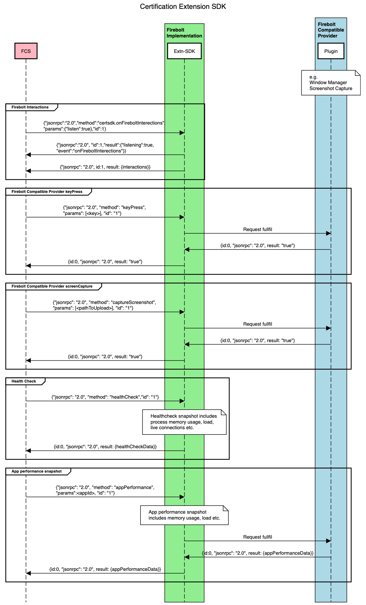

# Firebolt Extension for Certification

Document Status: Proposed Specification 

See [Firebolt Requirements Governance](../../governance.md) for more info.

## 1. Overview
Document contains the  details around Firebolt Extension for Certification (will be called as FEC in rest of the document) and HLA for the same.

## 2. Table of Contents
- [Requirements](#requirements)
- [HLA](#hla)

## 3. Requirements
FEC would required below use cases to adhere.

  - <b>Platform Health check Statistics</b>
    - Statistics from Firebolt-Implementation such as load, memory usage, how many firebolt connections are currently active, and what apps
    - Capability: <b>xrn:firebolt:capability:certification:healthcheck</b>
  - <b>App Health check Statistics</b>
    - Snapshot of the performance for app such as load, and memory
    - Capability: <b>xrn:firebolt:capability:certification:healthcheck</b>
  - <b>Firebolt compatible provider calls</b>
    - <b>Command and Control</b>
      - To control the firebolt compatible device e.g. interaction on screen, media playback control
      - Capability: <b>xrn:firebolt:capability:certification:commandandcontrol</b>
    - <b>Screenshot</b>
      - Fetch the screenshot and uploads stores in the device
      - Capability: <b>xrn:firebolt:capability:certification:screencapture</b>

## 4. HLA

