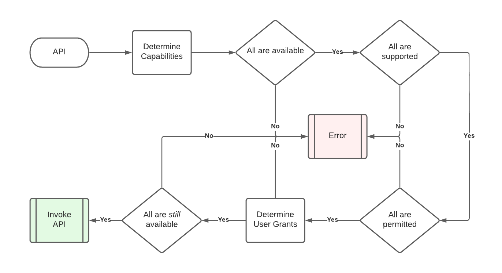

# Capabilities

Document Status: Candidate Specification

See [Firebolt Requirements Governance](../../../governance.md) for more info.

| Contributor    | Organization   |
| -------------- | -------------- |
| Andrew Bennett            | Sky            |
| Tim Dibben | Sky |
| Jeremy LaCivita | Comcast |
| Kevin Pearson | Comcast | 
| Peter Yu | Comcast |

## 1. Overview

This document introduces Firebolt Capabilities, which enable discovery
of supported features, negotiation of App permissions, and end-user
grants for Apps to access sensitive features.

Apps can detect if Capabilities are supported and available. If so, Apps
can **Use**, **Provide**, or **Manage** capabilities that they are given
access to.

The most common case is for an App to `use` a Capability, the platform
to `provide` it, and the Distributor\'s Settings App to `manage` it:


However, Apps may also provide Capabilities back to the platform:


## 2. Table of Contents
- [1. Overview](#1-overview)
- [2. Table of Contents](#2-table-of-contents)
- [3. Introduction to Capabilities](#3-introduction-to-capabilities)
  - [3.1. Capabilities](#31-capabilities)
  - [3.2. Availability](#32-availability)
  - [3.3. Permissions](#33-permissions)
  - [3.4. Roles](#34-roles)
  - [3.5. User Grants](#35-user-grants)
- [4. How Capabilities Work](#4-how-capabilities-work)
  - [4.1. Supported Capabilities](#41-supported-capabilities)
  - [4.2. Available Capabilities](#42-available-capabilities)
  - [4.3. Permitted Capabilities](#43-permitted-capabilities)
  - [4.4. User Granted Capabilities](#44-user-granted-capabilities)
  - [4.5. Invoking Capabilities](#45-invoking-capabilities)
- [5. Configuring Device Capabilities](#5-configuring-device-capabilities)
  - [5.1. Device Supported Capabilities](#51-device-supported-capabilities)
  - [5.2. Device Grant Policy Overrides](#52-device-grant-policy-overrides)
- [6. Capability Schemas](#6-capability-schemas)
  - [6.1. Firebolt Specification Manifest](#61-firebolt-specification-manifest)
  - [6.2. Firebolt Device Manifest](#62-firebolt-device-manifest)
- [7. Capability to Feature Mapping](#7-capability-to-feature-mapping)
  - [7.1. App installation](#71-app-installation)
  - [7.2. Firebolt APIs](#72-firebolt-apis)
  - [7.3. Extension APIs](#73-extension-apis)
  - [7.4. Hidden Permissions](#74-hidden-permissions)
- [8. Firebolt Capability Catalog](#8-firebolt-capability-catalog)
- [9. APIs](#9-apis)
  - [9.1. Core SDK APIs](#91-core-sdk-apis)
  - [9.2. Manage SDK APIs](#92-manage-sdk-apis)

## 3. Introduction to Capabilities

This section is non-normative and defines the key concepts behind the
Firebolt Capabilities system. Each portion of this section provides a
background and conversational definitions of the terms used in the rest
of this document, and through all Firebolt Requirements Specifications.

### 3.1. Capabilities

A Capability is a discrete unit of functionality that a Firebolt device
might be able to perform. It is granular enough to enable appropriate
access controls across all Firebolt Apps, but useful enough to be a
meaningful functional unit that an App might care about. Bluetooth is a
good example of a Capability.

The Firebolt Specification determines the range of possible
Capabilities.

Firebolt platforms advertise which Capabilities are supported. The set
of capabilities supported by a device is an immutable set and will never
change at runtime. Supporting Wi-Fi and having an active Wi-Fi
connection are two different things.

Firebolt platforms determine if an App is allowed to invoke the
different aspects of a Capability (see [Roles](#roles), below).

Firebolt Apps list which Capabilities are required and optional for the
App to be installed.

Firebolt Apps inspect which Capabilities are supported and active.

Firebolt Distributors sign off on some, or all, of the App's listed
required and optional Capabilities.

### 3.2. Availability

A Capability may rely on intermittently available resources, for example
a network capability requires an Ethernet or Wi-Fi network connection.

A supported capability is only considered available if those resources
could be used by the App right now (without taking into account any needed permissions or [User Grants](#user-grants)). For example, the needed
resources are not disabled, not tied up by the platform, and not experiencing
any intermittent network, hardware, or signal issues.

A supported capability is always supported, but it may not always be
*available*.

Availability of a capability is a global status, not a per-app status.

If a Capability is available, then it is considered available globally. 
Capabilities can not be available to one app, while simultaneously being 
unavailable to another app. This is handled by permissions, or by 
capability-specific error management, e.g. returning an error to an app that
attempts to use the video pipeline while in the Inactive Lifecycle state.

### 3.3. Permissions

A Permission is what allows an App to attempt to invoke an aspect of a
Capability. Permissions to a Capability are assigned to an App with a
[Role](#roles), by a Firebolt Distributor.

Firebolt documents and APIs will use the term "Permission"
interchangeably with phrases like:

-   An App's Assigned Role for a Capability

-   App + Capability + Role

-   Etc.

The Firebolt Specification determines which Capabilities require
Permissions.

The Firebolt Specification determines which Permission requirements may
be overridden by Distributors.

An App is considered to have Permission to a Capability if it is:

-   Listed with a Role in the App's manifest and signed by the App
    provider

-   Listed and signed again by the Distributor on the App's behalf

-   Listed and signed by the App Publisher when running in self-signed developer
    mode

An App can invoke a Capability if:

-   It has permission, which includes a Role, for that capability

-   The capability is supported by the current device

-   The App is invoking aspects of the capability that it has the
    appropriate Role for

-   The capability is [Available](#availability) at time of invocation

See [Permitted Capabilities](#permitted-capabilities) for more info.

### 3.4. Roles

Every Firebolt Capability has exactly three roles:

-   Use

-   Manage

-   Provide

While these roles will be defined on a case-by-case basis for each
capability, they should generally follow the guidelines set here.

The `Use` role is for providing basic access so that an App can leverage
the standard use cases of the Capability. The `Use` role will not enable
an App to perform management tasks such as turning the Capability on and
off for the entire device. The `Use` role will not enable an App to
perform administrative tasks such as renaming HDMI inputs, etc.

The `Manage` role is for providing access to a Capability's management
and administrative features. This role may be used to allow an App to
build a Settings UI for the Capability, for example. The `Manage` role
is not for creating tiers of permissions within a Capability, but for
separating out administrative APIs, for example turning a feature on and
off.

Most Capabilities are provided by the platform, denoted by making the
`Provide` role `private` for that Capability. However, there are use
cases where Apps may provide Capabilities. The `Provide` role allows for
declaring that an App *implements* the Capability and can be registered
with the platform for fulfilling the Capability's features. This could
be used for functionality that needs to be customized from Distributor
to Distributor. The `Provide` role may also be used to allow Apps to
contribute to aggregated functionality, for example a federated search
feature. By providing a capability, an App is signing up to implement
any `Use` or `Manage` APIs required by that capability.

Each role must be explicitly assigned. An App *never* inherits the
operations from one role by virtue of being granted another. Roles may
have overlapping functionality.

A [Permission](#permissions) is the combination of a Capability w/ a
Role and determines which specific operations are permitted.

### 3.5. User Grants

A User Grant allows some Permissions to depend on the User of the
Firebolt Device to explicitly grant access for one or all Apps to use a
specific Capability. This an additional layer of access control on top
of Permissions.

The Firebolt Specification determines which Permissions require User
Grants by default.

It is not possible to require a User Grant for a Capability that is open
to all Apps.

Distributors may override any User Grant details that are defined by the
Firebolt Specification if that User Grant Policy is set to
`overridable: true`.

Consumers want to know that their Smart TV platform treats
security as a first-class design principal. As such, table-stakes User
Grant policies, e.g. App access to Bluetooth, may be denoted as
overridable: false in the Firebolt Specification, to remove any
possibility of a security flaw.

An App is considered to have a User Grant to a Capability if it:

-   Has Permission to the Capability

-   The User Grant is for the same Role as the Permission above

-   The Capability is **securely** approved by the device user

If an App invokes a Capability but does not have an active User Grant,
then the platform will block invocation, prompt the user for a grant,
and then continue with the original invocation, e.g. the App does not
have to call the originating API again (assuming the user did give their
approval).

See [User Granted Capabilities](#user-granted-capabilities) for more
info.

## 4. How Capabilities Work

A given Capability may or may not be supported or available.
Additionally, a given Role may or may not be permitted or granted for a
given Capability.

While support and availability of a Capability is static and global, the
permission and grant status may differ from App to App.

Determining the status of a Role and Capability is fundamental to
both the Platform and the Apps that run on it.

### 4.1. Supported Capabilities

Once an App has been launched, it may need to check if a certain
capability is supported to present the appropriate user experience. For
example, an App may want to put Dolby Atmos badges next to its content,
but only if the platform supports Dolby Atmos.

The Firebolt Specification determines which capabilities **MUST** be
supported by all Firebolt Devices, by listing those Capabilities in the
[Firebolt Specification Schema](#61-firebolt-specification-schema) as `level: "must"` in the Capabilities
array.

For a capability to be supported, it **MUST** have *one* or *both* of
the following:

> A supported capability **MUST** have the necessary hardware and
> software to invoke all required aspects of all Roles of the
> capability.
>
> **OR**
>
> A supported capability **MUST** have the necessary hardware and
> software to support a *certified*, after-market peripheral that
> provides the capability. Note that this includes peripherals that have
> not yet been connected to or installed on the device.

However, a Firebolt device **MUST NOT** be considered to support a
capability if the capability is disabled by the static distributor
configuration.

The platform **MUST** return accurate responses based on these
requirements to all [APIs](#apis) outlined below.

### 4.2. Available Capabilities

Once an App has been launched, it may need to check if a certain
capability is available, to start the appropriate user experience. For
example, an App that uses an external camera may need to check if the
user has set up their camera before proceeding to the main user
experience.

A Capability is available if **all** the following are true:

> An available Capability **MUST** be supported.
>
> An available Capability **MUST** have a provider, either an App, an
> Extension SDK, or the OS itself.
>
> The provider of the Capability **MUST** consider it to be available
>
> An available Capability **MUST NOT** be currently disabled by any
> user, account, or device setting.
>
> An available Capability **MUST** be considered available by at least
> one provider of the capability. This is specified by the requirements
> for each feature.

An available Capability **MAY** be tied to a User Grant, regardless of
whether the user has granted it yet. Secure user grants gate permission,
not availability.

The platform **MUST** return accurate responses based on these
requirements to all [APIs](#apis) outlined below.

### 4.3. Permitted Capabilities

Capabilities may be permitted to *all* Apps by the [Firebolt
Specification Schema](../../firebolt-specification.json), or to individual Apps by the Distributor-signed
App Manifest.

An App may need to know if a Capability is permitted to it once it has
been launched. For example, it may need to check if a certain capability
is permitted, to enable the correct features for the current
distributor. For example, an App that has just been installed might not
show a Returns true for capability/role combinations that do not r
Sign-up option when running on a distributor that has not allowed it to
`use` the `commerce:subscribe` capability, and only allow existing users
to sign in.

Determining if a Capability is permitted requires knowing which **Role**
is being leveraged.

Permitted capabilities **MUST** be denoted as `public` in the Specification Schema](#61-firebolt-specification-schema).

Additionally, **one** of the following **MUST** be true as well:

> The Role **MUST** have `negotiable` set to `false`
>
> **OR**
>
> The Role **MUST** be approved for the capability by the distributor in
> the App Manifest

A permitted Capability **MAY** be tied to a User Grant, regardless of
whether the user has granted it yet.

The platform **MUST** return accurate responses based on these
requirements to all [APIs](#apis) outlined below.

### 4.4. User Granted Capabilities

Some Capabilities may require a User Grant. It is the App's choice
whether it requests these grants at launch or allows the platform to
interrupt the App's experience when User Grant-gated Capabilities are
invoked.

Determining if a Capability has been granted by the user requires
knowing which Role is being used.

For a Capability to be considered granted, it **MUST** be supported.

Additionally, a Capability + Role is granted to an App if **one** of the
following is true:

> A granted capability **MUST** have the Role securely granted to the
> App by the user and that grant must not be expired.
>
> **OR**
>
> A granted capability **MUST** have the Role permanently granted to the
> App by the App Manifest, e.g., if the user implicitly granted these by
> virtue of an end user license agreement.

Firebolt platforms **MUST** support acquiring a user grant *at the
moment the Capability is invoked*, without requiring any reinvocation of
the Capability.

See [User Grants](./user-grants.md), for more info.

The platform **MUST** return accurate responses based on these
requirements to all [APIs](#apis) outlined below.

### 4.5. Invoking Capabilities

When invoking a Capability, there are several factors that determine
whether the calling App will be allowed. The primary factor is which
Role is being leveraged by the invocation.

A given Capability & Role can be public or not, and it can be negotiable
or not.

If a Role for a Capability is public and non-negotiable, then all Apps
are allowed to invoke it, without any explicit permission from the
platform distributor. This is subject to support, availability, and any
required User Grants.

If a Role for a Capability is public and negotiable, then Apps **MUST**
be permitted by each distributor to use it on that distributor\'s
devices.

If a Role for a Capability is private, then it **MUST NOT** be permitted
or granted to any Apps.

A Role for a Capability **MUST NOT** be flagged as negotiable if it is
private.

If a Capability is gated by a User Grant requirement, then any
invocation **MUST** check the grant status for the Role in question, and
potentially re-acquire a User Grant for the App to invoke it.

The following flow diagrams show the order of operations for determining
if a Firebolt API, that depends on one or more capabilities, may be
invoked. The checks in this diagram **MUST** be executed in this order
to ensure that error codes are consistent and User Grant prompts are not
displayed to end users in situations where the API call will still not
be allowed for other reasons.



Note that determining user grants may involve presenting a UX to the end
user. During this time, a necessary capability may become unavailable.
Due to this, necessary Capabilities MUST be reevaluated for availability
after determining user grant status. For a more detailed flow diagram
for evaluating User Grants, see [User Grants](./user-grants.md).

## 5. Configuring Device Capabilities

The Firebolt Specification describes all the possible, non-Extension
capabilities that a particular version of Firebolt allows. Individual
Firebolt devices, however, may not support every Capability and may want
to override certain aspects of those Capabilities.

Every Firebolt-compliant device **MUST** include an official, versioned
Firebolt JSON configuration that conforms to the Specification Schema](#61-firebolt-specification-schema), so that the implementation
knows how to configure each capability, and which aspects are
overridable.

Additionally, every Firebolt-compliant device **MUST** have a versioned

Firebolt Device JSON configuration that conforms to the Firebolt Device
Schema, so that the implementation knows how each capability has been
overridden by the Distributor for this device.

See [Firebolt Device Schema](#firebolt-device-schema) for more info.

### 5.1. Device Supported Capabilities

Firebolt-compliant devices **MUST** list all the Capabilities they
support in the Device Capabilities configuration file\'s `supported`
array.

The `supported` array **MUST** contain a `CapabilityConfig` for every
Firebolt Capability supported by this device.

The `supported` array **MUST** contain an entry for every Capability
from the Specification Schema](#61-firebolt-specification-schema) that has a level of `must`.

The `supported` array **MAY** contain entries for any `should` or
`could` Capabilities.

The supported array **MUST NOT** contain any entries for Capabilities
not found in the Firebolt Specification Schema.

### 5.2. Device Grant Policy Overrides

Firebolt-compliant devices **MAY** override any `GrantPolicies` that
have `overridable` set to `true`.

This can be used to permanently disable a User Grant

Firebolt-compliant devices **MUST NOT** override any `GrantPolicies`
that have `overridable` set to `false`.

`GrantOverrides` are included in the `grantOverrides` array of the
`CapabilityConfig` for the Capability in question.

If both the Firebolt Specification Schema and the Device Schema have
different, valid overrides for the same capability + appId, then the
device config **MUST** be used by that device.

## 6. Capability Schemas

This section describes how Capabilities are represented in the static
Firebolt configuration for a device.

### 6.1. Firebolt Specification Manifest

Each version of Firebolt **MUST** have a single Firebolt Specification
Manifest that is the source-of-truth for and contains all possible
capabilities provided, used, or managed by Apps or Firebolt platforms.

+The Firebolt Specification Manifest **MUST** list all capabilities defined by that version of Firebolt.

The Firebolt Specification Manifest **MUST** specify whether each capability `must`, `should`, or `could` be implemented by Firebolt devices.

The Firebolt Specification Manifest **MUST** specify whether each role, i.e. `use`, `manage`, and `provide`, is a `public` permission that apps may call.

See [Invoking Capabilities](#46-invoking-capabilities), for more info on public and negotiable capabilities.

The Firebolt Specification Manifest **MUST** include the entire Firebolt OpenRPC specification for all APIs in the 'apis` block.

The Firebolt Specification Manifest **MUST** specify which major versions of the Firebolt RPC APIs are required for backwards compatibility.

The [Firebolt Version Manifest JSON-Schema](https://github.com/rdkcentral/firebolt-configuration/blob/main/src/schemas/version-manifest/version-manifest.json) defines the JSON semantics for this file.

The latest version of the firebolt-specification.json **MUST** be available at this URL:

```
http://rdkcentral.github.io/firebolt/requirements/latest/specifications/firebolt-specification.json
```

The version of the firebolt-specification.json associated with this document **SHOULD** be available at [../../firebolt-specification.json](../../firebolt-specification.json).

### 6.2. Firebolt Device Manifest

Each Firebolt device will have a static configuration for overriding
which capabilities are supported, as well as any negotiable Capability
overrides. 

The Device Manifest **MUST** specify which capabilities the device supports.

The Device Manfiest **MUST** include every capability from the Firebolt Specification Manifest that has a `level` of `must` in its supported list.

The Device Manifest **MUST** specify which capabilities have distributor define Grant Policy Overrides.

The Device Manfiest **MUST NOT** have any Grant Policies that override Grant Policies from the Firebolt Specification Manifest that have `overridable` set to `false`.

The [Firebolt Device Manifest JSON-Schema](https://github.com/rdkcentral/firebolt-configuration/blob/main/src/schemas/device-manifest/device-manifest.json) defines the JSON semantics for this file.

## 7. Capability to Feature Mapping

Capabilities denote functionality, and functionality can manifest in several ways.

### 7.1. App installation

Some Apps may not be useful, and may even prove counter to their goals,
if installed on a device without certain capabilities. For example, a
Dolby Vision demonstration App that requires it only be installed on
devices that support Dolby Vision, to avoid playing back lower quality
content that users might mistake for Dolby Vision content.

If an App includes a capability in one of its App Manifest's `required`
Capability lists:

-   `app.capabilities.used.required`

-   `app.capabilities.managed.required`

-   `app.capabilities.provided.required`

Then that App **MUST NOT** be installable on Firebolt devices that do
not support that capability.

Apps that have an unsupported capability inside one of its `optional`
lists **SHOULD NOT** be prevented from installation, unless there is
some other reason outside the scope of this document.

### 7.2. Firebolt APIs

Some Firebolt APIs may require the use of one or more Capabilities.
These methods **MUST** have all required Capabilities listed in the method's OpenRPC schema.

Capabilities are listed in one of three OpenRPC extensions attached to
the `'capabilities' `tag on the method: `x-uses`, `x-manages`,
`x-provides`. 

If a method lists more than one Capability for a role, then it may
specify that those capabilities are either all required, any combination
of them is required, or one and only one is required. The platform **MUST parse any `x-uses-operator` values which will have values of either `allOf`, `anyOf`, or `oneOf`. This value defaults to `allOf` if not specified. An example of
this is an API to find and pair remotes, regardless of which connection
protocol is needed. This API requires `anyOf` `bluetooth:scan`,
`rf4ce:scan`, `wifi:scan`. If one or more of these capabilities is
available (and permitted) then the API will execute using the available
and permitted protocols. The same pattern applies to `x-manages-operator`. The `x-provides` extension only supports a single capability, so this pattern does not extend to providers.

If a method *requires* a capability, and that capability requires a user
grant that the App does not have, then the platform **MUST** block and
initiate a User Grant flow. Once granted, the platform **MUST** return
the expected value without the App having to reinvoke the API. If not
granted after the User Grant flow, the platform **MUST** return an
error.

Capabilities that enhance an API, but are not fundamentally required,
for example a `play` API optionally uses the `'hdr:dolbyvision'`
capability, **MUST NOT** be listed in the OpenRPC schema. These are considered *optional* capabilities of the method implementation.

If a method leverages an *optional* Capability that is unavailable or
unpermitted, it **MUST** leave out or defer the optional functionality.

If a method leverages an *optional* Capability that requires a user
grant the App does not have, it **MUST** leave out the optional
functionality, and it **MUST NOT** request a user grant.

### 7.3. Extension APIs

Extension SDKs implement their methods in the cloud but rely on
Firebolt's Permissions and Capabilities model.

Requirements for Extension SDKS are outside of the scope of this document.

### 7.4. Hidden Permissions

A hidden permission arises when an API requires permission to one
Capability which in turn requires another Capability gated by a
different permission. This is not supported by Firebolt, and all
permission dependencies should be validated to avoid this.

Firebolt Capabilities **MUST NOT** have hidden permissions.

For example:

-   API `Module.methodOne()` requires permission to `use` the
    `'contrived:capability1'` Capability

-   API `Module.methodTwo()` requires permission to `use` the
    `'contrived:capability2'` Capability

-   `methodOne`'s implementation calls `methodTwo`

There is now a hidden permission: `methodOne` requires both
`capability1` and `capabilty2`.

Note that it's fine for a method to leverage an ungated, but also
unavailable Capability, such as a DIAL API failing because the network
capability is unavailable.

## 8. Firebolt Capability Catalog

Firebolt Capabilities are enumeraged in the [Firebolt Specification Manifest](../../firebolt-specification.json).

## 9. APIs
All of the APIs below have full OpenRPC schemas in the [Firebolt OpenRPC JSON document](../../../specifications/firebolt-open-rpc.json).

### 9.1. Core SDK APIs

Several APIs are exposed by the Firebolt Core SDK as part of the
`Capabilities` module. This module is intended for App
developers to have one place to check for all aspects of "can I do
this." Including supported, available, permitted, and granted
Capabilities. It also provides bulk operations for figuring out which
needed Capabilities are unavailable, in order to wait for them, and
which ones are ungranted, in order to request them.

### 9.2. Manage SDK APIs

Several APIs are exposed by the Firebolt Manage SDK as part of the
`UserGrants` module. This module is intended for
Management UIs that show a list of grants per App or Capability, and
allow users to revoke them.
