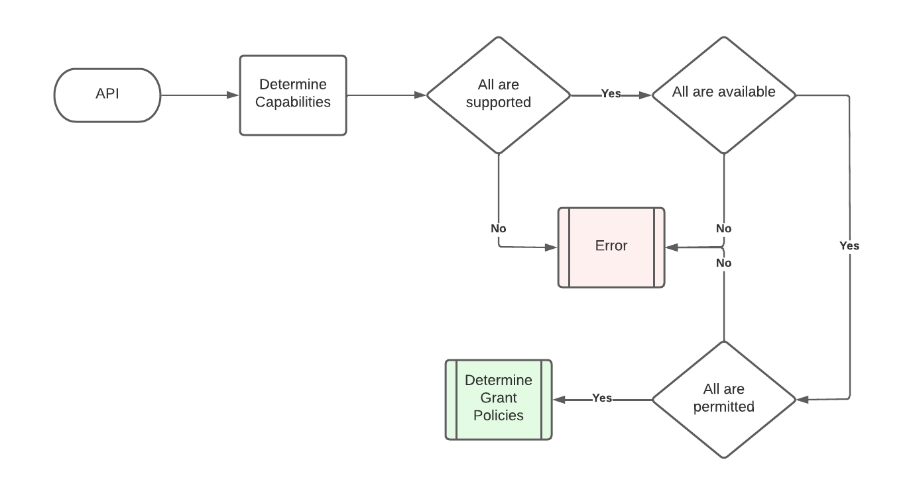

# User Grants

Document status: Candidate Specification

See [Firebolt Requirements Governance](../../../governance.md) for more info.

| Contributor    | Organization   |
| -------------- | -------------- |
| Andrew Bennet            | Sky            |
| Tim Dibben | Sky |
| Jeremy LaCivita | Comcast |
| Kevin Pearson | Comcast |
| Peter Yu | Comcast |

## 1. Overview

This document describes the requirements for Firebolt User Grants. User
Grants enable end-user control over which Apps have access to
potentially sensitive Firebolt Capabilities. For example, a user might
want to explicitly approve of any App attempting to purchase new content
by entering an account-holder PIN on the RCU.

User Grants are also common when two apps need to share data, for
example, Firebolt has a `Discovery.watched` method that allows apps to
inform Firebolt that a user has finished watching some content. This
method allows an app to **provide** the watch history capability and the
aggregated experience to **use** it. See Firebolt
[Capabilities](./capabilities.md) requirements for more info on the `use` and `provide` roles of a
capability.

This sort of data exchange involves several parties: minimally the user,
the publisher of the OTT app, and the distributor of the Firebolt
device. Additionally, this exchange could also involve privacy laws of
the user\'s home geo-political state, local I.T. best practices around
PII, or even a particular product\'s public position on their privacy
offering to the market. Because of the importance and complexity of
personal data, Firebolt allows each distributor to configure which
Firebolt capabilities require User Grants and what policies should be
applied to acquiring those grants.


Distributors can configure what kind of user grant is required for a
particular capability, e.g. a simple acknowledgement of an \"OK\"
button, an account-owner PIN entry, an account-owner three-factor
authentication challenge, etc.

Distributors can also configure whether certain user grants are opt-in
or opt-out, and whether explicit prompting of the user is required.

## 2. Table of Contents
- [1. Overview](#1-overview)
- [2. Table of Contents](#2-table-of-contents)
- [3. Introduction to User Grants](#3-introduction-to-user-grants)
  - [3.1. Active Grant](#31-active-grant)
  - [3.2. Denied Grant](#32-denied-grant)
  - [3.3. Unset Grant](#33-unset-grant)
  - [3.4. Granting Capability](#34-granting-capability)
  - [3.5. Grant Policy](#35-grant-policy)
  - [3.6. Privacy Setting](#36-privacy-setting)
- [4. User Grant Requirements](#4-user-grant-requirements)
  - [4.1. Granting Capability](#41-granting-capability)
    - [4.1.1. Acknowledgement](#411-acknowledgement)
    - [4.1.2. Pin Challenge](#412-pin-challenge)
  - [4.2. Grant Policy](#42-grant-policy)
    - [4.2.1. Grant Requirements](#421-grant-requirements)
    - [4.2.2. Grant Lifespan](#422-grant-lifespan)
    - [4.2.3. Grant Privacy Setting](#423-grant-privacy-setting)
  - [4.3. Distributor Overrides](#43-distributor-overrides)
  - [4.4. Application Overrides](#44-application-overrides)
- [5. Grant Execution](#5-grant-execution)
  - [5.1. Capability Check](#51-capability-check)
  - [5.2. Grant Policy Resolution](#52-grant-policy-resolution)
  - [5.3. Active Grant Check](#53-active-grant-check)
  - [5.4. Grant Prompt and Resolution](#54-grant-prompt-and-resolution)
- [6. Schemas](#6-schemas)
  - [6.1. Grant Policy](#61-grant-policy)
  - [6.2. GrantRequirements](#62-grantrequirements)
  - [6.3. GrantStep](#63-grantstep)
  - [6.4. GrantKey](#64-grantkey)
    - [6.4.1. GrantScope](#641-grantscope)
    - [6.4.2. GrantLifespan](#642-grantlifespan)
    - [6.4.3. PrivacySetting](#643-privacysetting)
- [7. APIs](#7-apis)
  - [7.1. Manage SDK APIs](#71-manage-sdk-apis)
    - [7.1.1. GrantInfo Object](#711-grantinfo-object)
    - [7.1.2. App Method](#712-app-method)
    - [7.1.3. Device Method](#713-device-method)
    - [7.1.4. Capability Method](#714-capability-method)
    - [7.1.5. Grant Method](#715-grant-method)
    - [7.1.6. Deny Method](#716-deny-method)
    - [7.1.7. Clear Method](#717-clear-method)


## 3. Introduction to User Grants

This section defines the key concepts behind the Firebolt User Grant
system. User Grants build on top of [Firebolt
Capabilities](./capabilities.md).
Since Capabilities are fundamental to user grants, it is recommended to
read the Capabilities requirements first before reading this document.

Each portion of this section provides a background and conversational
definitions of the terms used in the rest of this document, and through
other Firebolt Requirements Specifications.

As described in the Overview, a User Grant allows an end user to
explicitly allow (or not allow) an app to use certain Firebolt
Capabilities. Firebolt Distributors need flexibility in configuring
which Capabilities require what types of user interaction, PIN vs
password, etc.

The following concepts inform how the Firebolt User Grant APIs and
architecture are designed.

### 3.1. Active Grant

An **Active Grant** is a User Grant that has already been granted by the
user for a Capability to a specific app (if the Grant Policy is per-app)
or all apps. Active Grants do not need to be granted again (until they
expire) and may be revoked or expire.

### 3.2. Denied Grant

A **Denied Grant** is a User Grant that has already been explicitly
*denied* by the user for a Capability to a specific app (if the Grant
Policy is per-app) or all apps. Denied Grants do not need to be denied
again (until they expire) and may be revoked or expire. This serves to
allow the Grant Policy lifetime to be applied to explicit denials as
well.

### 3.3. Unset Grant

An **Unset Grant** is a User Grant that has no persisted state. This
could be because the user has never granted or denied it, or because it
was previously granted/denied, but has since expired. Additionally, the
user or platform may clear out an active or denied grant, which results
in this state.

### 3.4. Granting Capability

User grants typically require some sort of user experience. Firebolt
delegates display of these user experiences to (typically) first-party
apps, which must provide them as **Granting Capabilities**. Therefore,
it\'s quite possible that using a capability such as watch history
initiates a User Grant request which itself requires another capability,
e.g. the \"acknowledge\" capability, to fulfill the original API.

In the following diagram, an OTT App is calling an API that would share
watch history data with the 1st party aggregated experience on the
device. This capability is configured with a [Grant
Policy](#grant-policy) (see below) that specifies use of an
Acknowledgement Challenge Capability. the \"Watch History\" capability
is what is being accessed, and the \"Acknowledgement Challenge\"
capability is how this device is configured to grant access to that
capability. Said another way, the Acknowledgement Challenge is the
*Granting Capability*.


Note that the granting capability UI is provided by another app. The
Provider APIs for each granting capability type are out of scope for
this document.

A granting capability is generally agnostic to the original capability
that it is helping to grant and can be reused by several capabilities
via a Grant Policy.

### 3.5. Grant Policy

A **Grant Policy** ties a set of user grant-related configuration values
to a capability. This allows a Firebolt distributor, or the Firebolt
specification itself, to define the business policy of a particular user
grant.

Grant Policies specify details like how long the grant lasts and what is
the scope of the grant, e.g. a single app, or all apps.

### 3.6. Privacy Setting

A **Privacy Setting** is a link between a Grant Policy and any Firebolt API that is tagged with the Property pattern and returns a
`boolean`. This allows User Grant state to be linked to Privacy Settings
on the device or account.


How Firebolt devices persist Privacy Settings is outside the scope of
this document.

## 4. User Grant Requirements

### 4.1. Granting Capability

A granting capability **MUST** have the category portion of its
capability key set to `usergrant`. For example:

`xrn:firebolt:capability:usergrant:acknowledge`

In order for a granting capability to be available, it **MUST** be
provided by some app that is currently loaded.

Each granting capability **MUST** have a schema, in the Firebolt
Specification Schema, to validate that any configuration associated with
it is valid.

#### 4.1.1. Acknowledgement

The Acknowledgement capability enables a user to acknowledge a user
grant by simply clicking a button.

This capability has the following key:

`xrn:firebolt:capability:usergrant:acknowledgechallenge`

The configuration for this capability is always `null`, i.e., there is
no configuration.

For more info on how an app can provide the acknowledge capability, see
Acknowledge Provider. **TODO**: add link.

#### 4.1.2. Pin Challenge

The Pin Challenge capability enables a user to confirm that they are the
account owner, or a delegate of, by responding to a numeric PIN
challenge.

This capability has the following key:

`xrn:firebolt:capability:usergrant:pinchallenge`

For more info on how an app can provide the acknowledge capability, see
Pin Challenge Provider. **TODO**: add link.

### 4.2. Grant Policy

If a Capability is configured with a `GrantPolicy` then the User Grants
specified by the Grant Policy **MUST** be evaluated before a GrantPolicy
llowing access to that Capability.

A Grant Policy **MUST** have a `scope` for the grant, which determines
whether the user will be granting the capability to the current app or
to all apps.

A Grant Policy **MUST** have an `overridable` flag that determines if it
may be overridden downstream. For Grant Policies in the Firebolt Version
Manifest, the Device Manifest may override if `overridable` is `true`.
For Grant Policies in the Device Manifest, individual [App
Manifests](https://github.com/rdkcentral/firebolt-configuration/src/schemas/app-manifest/app/app.json) may override the grant if `overridable` is `true`.

#### 4.2.1. Grant Requirements

A Grant Policy **MUST** have at least one `GrantRequirements` object,
which itself has a list of zero or more [Granting
Capabilities](#granting-capability) and their configurations. If all the
granting capabilities are supported and available, then they all
**MUST** be invoked. This allows for multiple security checks, e.g.
allow watch history data to be collected if the user has opted into
usage data collection **and** they confirm via an acknowledgement
challenge UI. If one or more of the granting capabilities is not
supported or available, then the entire Grant Requirements block is not
valid for acquiring a user grant.

A Grant Policy **MAY** have more than one `GrantRequirements` object,
which are ranked in order of preference. This allows for low-friction
but high-security methods to be preferred, e.g. allow in-app purchases
with a passive facial recognition scan, with higher-friction fallbacks
to ensure security on devices with less capabilities, e.g. allow in-app
purchases if the account owner performs a multi-factor authentication
flow. This list of `GrantRequirements` objects is stored in the Grant
Policy\'s `options` field.

If a Grant Policy has more than one `GrantRequirements` option, then the
highest priority list with all its required capabilities supported and
available **MUST** be used. Note that the app which initiated the
original capability check **does not** need to have permission (or a
grant) to any of the granting capabilities that might be invoked. The
app is not using them, the Firebolt device is using them.

#### 4.2.2. Grant Lifespan

A Grant Policy **MUST** have a `lifespan`, which determines how long a
grant is valid for.

> If the lifespan is set to `once`, then any grant resulting from this
> policy **MUST** be active for a single API transaction.
>
> If the lifespan is set to `forever`, then any grant resulting from
> this policy **MUST** be active until explicitly revoked.
>
> If the lifespan is set to `appActive`, then any grant resulting from
> this policy **MUST** be active until the app goes into one of the
> `inactive`, `suspended`, or `unloading` states.
>
> If the lifespan is set to `powerActive`, then any grant resulting from
> this policy **MUST** be active until the device power goes into any
> state other than `active`.
>
> If the lifespan is set to `seconds`, then any grant resulting from
> this policy **MUST** be active until `lifespanTtl` seconds have passed
> since the grant was issued.

If a Grant Policy has the `lifespan` set to `seconds`, then the
`lifespanTtl` **MUST** be set to a non-zero, positive number of seconds.

#### 4.2.3. Grant Privacy Setting

A Grant Policy **MAY** have a `PrivacySetting` object, which
associates any Firebolt `boolean` property API with this Grant Policy.
The Privacy Setting points to the RPC name of the property\'s getter
method.

The associated property API **MUST** have an `x-allow-value` extension
on the \"property\" tag set to true or false.

If a Grant Policy has a Privacy Setting, then the `PrivacySetting`
**MUST** be evaluated **before** any `GrantRequirements`.

> The Privacy Setting **MUST** have an `autoApplyPolicy` which **MUST**
> be one of the following values:
>
> `always` - Silently grant if the getter for the `property` returns the
> property\'s `x-allow-value`. Silently deny if the getter for the
> `property` returns `!x-allow-value`.
>
> `allowed` - Silently grant if the getter for the `property` returns
> the property\'s `x-allow-value`.
>
> `disallowed` - Silently deny if the getter for the `property` returns
> the property\'s `!x-allow-value`.
>
> `never` - Do not silently grant or deny based on this Grant Policy.
>
> If the Privacy Setting has `revokeGrantsOnDisallow` set to `true`,
> then **all active** user grants that resulted from this Grant Policy
> **MUST** be revoked if and when the property value specified by
> `property` ever changes to `!x-allow-value`. This enables
> distributors to decide whether changes to a Privacy Setting affects
> only new User Grants or existing, active User Grants as well.
>
> If the Privacy Setting has `updateProperty` set to `true`, then a
> successful user grant from this Grant Policy **MUST** also result in
> updating the property value specified by `property` to
> `x-allow-value`.
>
> If the Privacy Setting has `updateProperty` set to `true`, then a
> rejected **or expiring** user grant from this Grant Policy **MUST**
> also result in updating the property value specified by `property` to
> `!x-allow-value`. This is considered a \"disallow\" and
> **MUST** initiate evaluation of the `revokeGrantsOnDisallow` value.
>
> If the Grant Policy `scope` is set to `app` then the property
> specified by `property` **MUST** have a single context
> parameter of type `string` and the requesting appId **MUST** be passed
> to all get/set/subscribe calls fulfilling this section of requirements.

### 4.3. Distributor Overrides

Capability Grant Policies in the Firebolt Version Manifest are designed
to be overridden by Distributors to allow for different privacy use
cases across businesses and geographic regions. These overrides go in
the Device Manifest under the `grantPolicies` section of the
`capabilities` section.

Distributor overrides **MUST** be for Grant Policies that are
`overridable`.

See the [Firebolt Configuration Schemas
repository](https://github.com/rdkcentral/firebolt-configuration/) for
more information on the Firebolt Version Manifest and Device Manifest.

### 4.4. Application Overrides

Firebolt supports creating active grants via the App manifest, which
allows distributors and App publishers to decide that a particular app
will already be granted some capability. This is typically used for
first-party apps that come pre-installed but could be used for other
purposes.

If an app has a role/capability listed in its App Manifest, then it is
considered to have an active grant for that capability if the manifest
has a valid signature.

App Manifests overrides **MUST** be for Grant Policies that are
`overridable` and scoped to `app`.

See the [Firebolt Configuration Schemas
repository](https://github.com/rdkcentral/firebolt-configuration/) for
more information on Firebolt App Manifests.

## 5. Grant Execution

When a Firebolt API is called the platform **MUST** first collate all
the device User Grant configurations that apply to every capability that
the API uses. This list **MUST** then be filtered to remove any User
Grants that have already been granted for the current capability for
this app and role.

### 5.1. Capability Check

First, all capabilities necessary to fulfill the API are collected.



### 5.2. Grant Policy Resolution

Next, each capability is checked to see if there is a Firebolt,
Distributor, or App Grant Policy that applies, and that none of them are
invalid, e.g. an override that is now allowed.


### 5.3. Active Grant Check

Then, each Grant Policy is evaluated to see if there is already an
active grant, or if it is linked to a Privacy Setting configured to skip
user-prompts.


### 5.4. Grant Prompt and Resolution

Finally, each needed Granting Capability is invoked to present a UX to
the end user, and any linked Privacy Settings are updated as
appropriate. If all succeeds, then the API is invoked.


## 6. Schemas

The following schemas give an overview of the schemas outlined by this
document. See the [Firebolt Configuration Schemas
repository](https://github.com/rdkcentral/firebolt-configuration/) for
the latest versions of these schemas.

### 6.1. Grant Policy

Grant Policies have the following properties.

| Property         | Type                        | Description                                                                                                                                                                                    |
|-------------|-----------------------|-------------------------------------|
| `options`        | `GrantRequirements[]` | An array of GrantRequirements, any one of which could be used to Grant a requested capability/role to an App. The first one that is completely supported by the current device should be used. |
| `scope`          | `string<GrantScope>`    | Whether the resulting user grant applies to all Apps or just the requesting App.                                                                                                               |
| `lifespan`       | `string<GrantType>`     | How long the resulting user grant (or deny) will last.                                                                                                                                         |
| `lifespanTtl`    | `integer`                   | If lifespan is `'seconds'` this represents the number of seconds.                                                                                                                              |
| `privacySetting` | `PrivacySetting`            | Links this Grant Policy to a privacy setting.                                                                                                                                                  |
| `overridable`    | `boolean`                   | Whether a distributor may override this GrantPolicy with their own.                                                                                                                            |

### 6.2. GrantRequirements

A list of `GrantSteps` objects describing which capabilities and any
optional configuration needed to fulfill this grant policy. These
capabilities must be from the capability category `usergrant` which
denotes special capabilities that perform user grants, e.g. an
acknowledge challenge capability.

| Property | Type                | Description                                                                           |
|-------------|-----------------|-------------------------------------------|
| `steps`  | `GrantStep[]` | An array of GrantSteps, all of which need to be verified to fulfill this GrantPolicy. |

### 6.3. GrantStep

| Property            | Type                     | Description                                                                    |
|-------------|----------------|-------------------------------------------|
| `capability`    | `string<GrantKey>` | The Granting Capability to use for this step in the grant flow.                |
| `configuration  ` | `object<any>`            | The configuration for the Granting Capability, which is specific to each type. |

### 6.4. GrantKey

A CapabilityKey with the \<category\> set to `usergrant`:

`/\^xrn:firebolt:capability:usergrant:\[a-zA-Z0-9\\-\]{1,32}\$/`

#### 6.4.1. GrantScope

A `string` enumeration.

| Value      | Description                                                     |
|----------------|--------------------------------------------------------|
| `device` | The resulting user grant will apply to all Apps on the device.  |
| `app`      | The resulting user grant will apply to the requesting App only. |

#### 6.4.2. GrantLifespan

A `string` enumeration.

The resulting user grant will only be valid:

| Value         | Description                                                            |
|----------------|--------------------------------------------------------|
| `once`        | for a single usage, e.g. one API call.                                 |
| `forever`     | until the end of time.                                                 |
| `appActive`   | until the app enters a non-Active Lifecycle state: inactive, suspended |
| `powerActive` | until the device leaves the Active power state.                        |
| `seconds`     | until \<seconds\> seconds have passed.                                 |

#### 6.4.3. PrivacySetting

| Value                      |         | Description                                                                                           |
|--------------------|----------|------------------------------------------|
| `property`                 | string  | The fully qualified RPC method name of the associated property setter, e.g. `Privacy.limitAdTracking` |
| `autoApplyPolicy`      | string  | Set the auto grant policy to `always`, `allowed`, `disallowed`, `never`                               |
| `revokeGrantsOnDisallow` | boolean | Any grants made from this policy will be revoked if/when the property is ever set to the deny value   |
| `updateProperty`           | boolean | Whether to update the property value to match the grant.                                              |

## 7. APIs

APIs for User Grants are covered in the [Capabilities Requirements
document](./capabilities.md).

### 7.1. Manage SDK APIs

These APIs are intended for trusted apps to expose a UI for end-users to
manage the grants given to the device and various apps. Permission for
these APIs should only be given to a trusted settings app performing
this function.

#### 7.1.1. GrantInfo Object

Object describing a persisted active or denied Grant.

```typescript
type GrantInfo = {
  appId: string,
  state: "active" | "denied",
  capability: string,
  role: "use" | "manage" | "provide"
  lifespan: "once" | "forever" | "appActive" | " powerActive" | "seconds"
  expires: integer
}
```

#### 7.1.2. App Method

Returns all active and denied user grants for the given App, **NOT**
including those granted to all apps via the device.

```typescript
UserGrants.app(appId: string): GrantInfo[]
```

#### 7.1.3. Device Method

Returns all active and denied user grants for the Device.

```typescript
UserGrants.device(): GrantInfo[]
```

#### 7.1.4. Capability Method

Returns all active and denied user grants for the given Capability.

```typescript
UserGrants.capability(capability: string): GrantInfo []
```

#### 7.1.5. Grant Method

Grants a given Capability, to a specific app if appropriate. Calling
this results in a persisted Active Grant that lasts for the duration of
the Grant Policy lifespan.


```typescript
UserGrants.grant(role: string, capability: string, appId?:string): void
```

#### 7.1.6. Deny Method

Denies a given Capability, to a specific app if appropriate. Calling
this results in a persisted Denied Grant that lasts for the duration of
the Grant Policy lifespan.

```typescript
UserGrants.deny(role: string, capability: string, appId?: string):void
```

#### 7.1.7. Clear Method

Clears any persisted active or denied grant for a Capability, for a
specific app if appropriate. This results in an Unset Grant. This method
may take a wildcard value of `'*'` for role, capability, or appId, in
order to clear grant state in bulk.

```typescript
UserGrants.clear(role: string, capability: string, appId?:string): void
```
