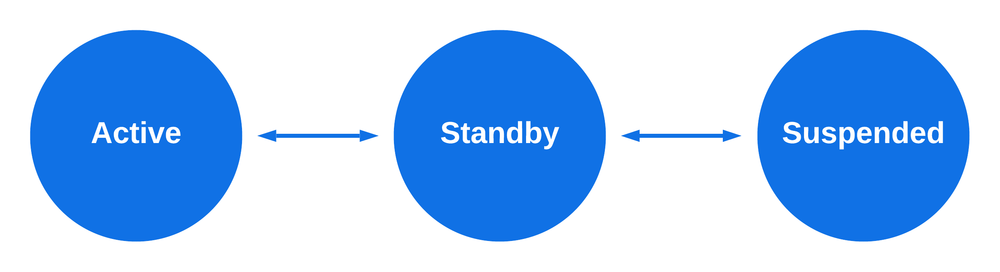

# Power Requirements
Document Status: Proposed Specification

See [Firebolt Requirements Governance](../../governance.md) for more info.

| Contributor    | Organization   |
| -------------- | -------------- |
| Andrew Bennett            | Sky            |
| Tim Dibben            | Sky            |
| Jeremy LaCivita            | Comcast            |
| Kevin Pearson            | Comcast           |
| Peter Yu            | Comcast            |

## 1. Overview
Power management of TVs and set-top boxes is a fundamental OS feature of
the Firebolt platform.

More words here...

The key words "**MUST**", "**MUST NOT**", "**REQUIRED**", "**SHALL**", "**SHALL NOT**", "**SHOULD**", "**SHOULD NOT**", "**RECOMMENDED**", "**NOT RECOMMENDED**", "**MAY**", and "**OPTIONAL**" in this document are to be interpreted as described in [BCP 14](https://www.rfc-editor.org/rfc/rfc2119.txt) [RFC2119] [RFC8174] when, and only when, they appear in all capitals, as shown here.

## 2. Table of Contents
- [1. Overview](#1-overview)
- [2. Table of Contents](#2-table-of-contents)
- [3. Physical Power Buttons](#3-physical-power-buttons)
- [4. Power States](#4-power-states)
  - [4.1. Active State](#41-active-state)
  - [4.2. Active-Standby State](#42-active-standby-state)
  - [4.3. Suspended State](#43-suspended-state)
- [5. Power State Transitions](#5-power-state-transitions)
  - [5.1. Booting the device](#51-booting-the-device)
  - [5.2. Active to Active-Standby](#52-active-to-active-standby)
    - [5.2.1. Inactivity](#521-inactivity)
  - [5.3. Active-Standby to Active](#53-active-standby-to-active)
  - [5.4. Active-Standby to Suspended](#54-active-standby-to-suspended)
    - [5.4.1. Deferring State Transitions](#541-deferring-state-transitions)
  - [5.5. Suspended to Active-Standby](#55-suspended-to-active-standby)
- [6. Power Saving Features](#6-power-saving-features)
  - [6.1. Reduced Power Mode](#61-reduced-power-mode)
  - [6.2. Overnight Power Saver](#62-overnight-power-saver)
- [7. Additional APIs](#7-additional-apis)
  - [7.1. Sleep](#71-sleep)
  - [7.2. Device Restart](#72-device-restart)
  - [7.3. Device Shutdown](#73-device-shutdown)
  - [7.4. autoStandby](#74-autostandby)
  - [7.5. networkEnabledWhileSuspended](#75-networkenabledwhilesuspended)
- [8. Power State Configuration](#8-power-state-configuration)

## 3. Physical Power Buttons

Devices **MUST** have a physical button dedicated to turning the device
on. This button **MAY** be on the device itself, or on a physical remote
that can be easily paired. This is referred to as a "physical power-on
button" throughout this document.

Devices **MUST** have a physical button dedicated to turning the device
off. This button **MAY** be on the device itself, or on a physical
remote that can be easily paired. This is referred to as a "physical
power-off button" throughout this document.

The *physical* *power-on button* and *physical* *power-off* *button*
**MAY** be different buttons.

Devices **MAY** have more than one of each button, e.g. one on-device
and one on a remote control.

The *physical* *power-on* *button* **MAY** perform a different function,
e.g. select/enter, when the device is already "on," e.g. an unlabeled
click/select/enter button that also turns the device on.

## 4. Power States

Firebolt devices **MUST** support three states: `active`,
`activeStandby`, and `suspended`. Note that when a device is
suspended, apps are not running, so this state may not appear in all
public-facing APIs.

### 4.1. Active State

The `active` state is when the device is fully running with the screen
or output signal on, and all services, features, and APIs that could be
available are available. This is the state in which end users are using
the device.

### 4.2. Active-Standby State

The `activeStandby` state is a mode where the screen or output signal
**MUST** be off. The device should appear to be off to the user, but may
in fact be fully running, aside from audio/video output.

### 4.3. Suspended State

The `suspended `state is a power-saving mode that is designed to conform
to local standards that differ from region to region. There are only a
limited set of inputs that may wake a device from this state, e.g. input
from the remote, or an HDMI-CEC wake message.

## 5. Power State Transitions

While the specific details of when to transfer from one power state to
another will differ from device to device, there some common
requirements that all devices must implement.

When `active` a device **MUST** only transition to `activeStandby`,
and **MUST** **NOT** transition to `suspended`.

When in `activeStandby` a device **MUST** only transition to `active`
or `suspended`.

When `suspended` a device **MUST** only transition to `activeStandby`,
and **MUST** **NOT** transition to `active`.

### 5.1. Booting the device

When booting, the device MUST dispatch the `onPowerOn` notification and
put the device into the `activeStandby` state. From there it should
retrieve the last-known power state. If the last-known state was written
to storage less than 30 minutes ago, then the device **MUST** transition
to that state and use `"powerOn"` as the notification `reason`. If it
was written to storage longer than (or equal to) 30 minutes, the device
**MUST** transition to `suspended` and use `“powerOn”` as the
notification reason. This duration may be set in the
`PowerPolicy.enforceActiveOnPowerDuration` configuration. If the
last-known state is unknown, the device **MUST** transition to the
`active` state, and send the `onActive` notification with a `reason` of
`“firstPowerOn”`.

### 5.2. Active to Active-Standby

When transitioning from Active to Active-Standby, the device **MUST**
dispatch the `onActiveStandby` notification.

If the device is in the `active` state, and a *physical power-on* button
is pressed, the device **MUST** transition to the `activeStandby` state
within 500 milliseconds and dispatch the `onActiveStandby` notification
with a `reason` of either:

-   `"frontPanel"`

-   `"rcu"`

Whichever is appropriate for the type of physical power-on button
pressed.

If the device is in the `active` state and receives a valid RPC call to
`Power.sleep()`, the device **MUST** transition to the `activeStandby`
state within 500 milliseconds and dispatch the `onActiveStandby`
notification with a `reason` of `"ux"`.

If any Apps are running in the `Lifecycle.foreground` or
`Lifecycle.background` states, the device **MUST** move those apps to
the `Lifecycle.inactive` state. See Lifecycle, for more information on
App Lifecycles.

If a device supports HDMI-CEC, then it **MUST** transition from `active`
to `activeStandby` upon receiving an HDMI-CEC 'standby' message from a
connected device, and send the `onActiveStandby` notification with a
`reason` of `"hdmiCec"`.

If a device supports far-field voice control, then it **MAY** transition
from `active` to `activeStandby` upon receiving an appropriate voice
command. If this transition is implemented, the device **MUST** send the
`onActiveStandby` notification with a `reason` of `"farFieldVoice"`.

If a device supports a soft remote, then it **MAY** transition from
`active` to `activeStandby` upon receiving a soft key press for the
power button. If this transition is implemented, the device **MUST**
send the `onActiveStandby` notification with a `reason` of `"rcu"`.

#### 5.2.1. Inactivity

Devices **MUST** have a method of keeping track of whether the device is
idle or not.

A Device is considered idle when there has been no interaction for a set
amount of time, which depends on the current mode and settings of the
device.

Interaction is any of the following:

-   Physical buttons on the device

-   Physical buttons on a paired remote

-   HDMI-CEC messages

-   Motion detection

-   Far-field voice commands

-   DIAL messages (optional)

If any of these occurs, all the following timelines are reset and must
start over.

If a device goes 4 hours without any interaction, then it is now
considered idle. This duration may be changed in the
`PowerPolicy.powerSaverTimeout` configuration.

If a device has set a specific HDMI input, or the OTA tuner, to be
active, and there has been no signal from that source and no interaction
for 15 minutes, then the device is now considered idle. This duration
may be changed in the `PowerPolicy.inputIdleTimeout` configuration.

If a device is not using a physical input source, and the audio/video
decoder has been inactive for 15 minutes, then the device is now
considered idle. This duration may be changed in the
`PowerPolicy.decoderIdleTimeout` configuration.

If the device is in the `active` state and becomes idle, the device
**MUST** transition to the `activeStandby` state within 500 milliseconds
and dispatch the `onActiveStandby` notification with a `reason` of
`"idle"`.

Devices **MUST** dispatch the `onInactivity` notification some number
milliseconds before (potentially) transitioning to `activeStandby` due
to a `reason` of `"idle"`. The duration for this is stored in the
`PowerPolicy.idleWarningTime` configuration.

Devices **MUST** dispatch the `onInactivityCancelled` notification if
the device becomes no longer idle after dispatching the `onInactivity`
notification, but before transitioning to `activeStandby`.

### 5.3. Active-Standby to Active

When transitioning from Active-Standby to Active, the device **MUST**
dispatch the `onActive` notification.

If the device is in the `activeStandby` state, and a *physical
power-off button* is pressed, the device **MUST** transition to the
`active` state within 500 milliseconds and dispatch the `onActive`
notification with a `reason` of either:

-   `"frontPanel"`

-   `"rcu"`

Whichever is appropriate for the type of physical power-on button
pressed.

Devices **MAY** transition for other physical buttons, as desired.

If any Apps had previously been running in the `Lifecycle.foreground` or
`Lifecycle.background` states, the device **MUST** move those apps back
into that state. See Lifecycle, for more information on App Lifecycles.

If a device supports HDMI-CEC, then it **MUST** transition from
`activeStandby` to `active` upon receiving an HDMI-CEC 'wake' message
from a connected device and dispatch the `onActive` notification with a
`reason` of `"hdmiCec"`.

If a device supports far-field voice control, then it **MAY** transition
from `activeStandby` to `active` upon receiving a voice command. If this
transition is implemented, the device **MUST** send the `onActive`
notification with a `reason` of `"farFieldVoice"`.

If a device supports a soft remote, then it **MAY** transition from
`activeStandby` to `active` upon receiving a soft key press for any
button. If this transition is implemented, the device **MUST** send the
`onActive` notification with a `reason` of `"rcu"`.

If a device supports DIAL then it **MAY** transition from
`activeStandby` to `active` upon receiving a DIAL message for an
installed and dispatch the `onActive` notification with a `reason` of
`"dial"`.

Devices **MAY** also support the following conditions for transitioning
from `activeStandby` to `active`:

-   A sensor in a paired remote that detects when it is raised or moved
-   A sensor in the device that detects when the user is moving in front
    of it

This list is not exhaustive.

### 5.4. Active-Standby to Suspended

Devices **MUST** have a method for keeping track of how long the power
state is in `activeStandby`. When a device is considered to have been
in the active-standby state long enough that a reduced power mode is
desired (the duration of which is specified in the
`PowerPolicy.reducedPowerTimeout` config), the device **MUST**
initiate a transition to the `suspended` state. Before transitioning to
the suspended state, the device **MUST** check to see if there are
critical system tasks, e.g. a system update, in progress, and if so, the
device **MUST** delay moving into the suspended state until there are no
more critical system tasks in progress (See Critical System Tasks).

Devices **MAY** also support the following conditions for transitioning
from `activeStandby` to `suspended`:

-   An extended press-and-hold of a designated physical button
-   A soft remote RPC message over the local network
-   A system message over the network

This list is not exhaustive.

#### 5.4.1. Deferring State Transitions

There are some cases where a device is doing system-critical tasks that
must not be interrupted by a transition into the `suspended` state, e.g.
a system update.

Devices **MUST** support blocking the transition to suspended when these
operations are in progress. Devices **MAY** abort the transition after
the system-critical tasks are done, or **MAY** resume it, or **MAY**
have logic to determine which is more appropriate. Devices MAY support
blocking this transition when third-party apps invoke the
`Power.startSystemTask()` and `Power.stopSystemTask()` APIs.

### 5.5. Suspended to Active-Standby

When transitioning from Suspended to Active-Standby, the device **MUST**
dispatch the `onResumeFromSuspended` notification.

If the device is in the `suspended` state, and a *physical power-on*
button is pressed, the device **MUST** transition to the `activeStandby`
state within 1500 milliseconds and dispatch the `onResumeFromSuspended`
notification with a `reason` of either: of either:

-   `"frontPanel"`
-   `"rcu"`

Whichever is appropriate for the type of physical power-on button
pressed.

If a device supports HDMI-CEC, then it **MUST** transition from
`suspended` to `activeStandby` upon receiving an HDMI-CEC 'wake' message
from a connected device and dispatch the `onResumeFromSuspended`
notification with a `reason` of `"hdmiCec"`.

If a device supports far-field voice control, then it **MAY** transition
from `suspended` to `activeStandby` upon receiving a voice command. If
this transition is implemented, the device **MUST** send the
`onResumeFromSuspended` notification with a `reason` of
`"farFieldVoice"`.

If a device supports a soft remote, then it **MAY** transition from
`suspended` to `activeStandby` upon receiving a soft key press for any
button. If this transition is implemented, the device **MUST** send the
[onResumeFromSuspended]{.smallcaps} notification with a `reason` of
`"rcu"`.

If a device supports DIAL then it **MAY** transition from `suspended` to
`activeStandby` upon receiving a DIAL message for an installed and
dispatch the `onResumeFromSuspended` notification with a `reason` of
`"dial"`.

Devices **MAY** also support the following conditions for transitioning
from `suspended` to `activeStandby`:

-   A sensor in a paired remote that detects when it is raised or moved
-   A soft keyboard event
-   A sensor in the device that detects when the user is moving in front
    of it
-   A system message over the network

This list is not exhaustive.

## 6. Power Saving Features

### 6.1. Reduced Power Mode

See Active-Standby to Suspended section on reduced power.

### 6.2. Overnight Power Saver

Some regions require an overnight power-saver configuration.

This may be configured using the RangedDurations in the Power
Configuration.

## 7. Additional APIs

The following programmatic APIs must be supported, to enable power
management use cases that are outside the scope of Firebolt.

### 7.1. Sleep

Devices **MUST** implement the `Power.sleep()` API. If called when in
the `active` state, the device **MUST** transition to the
`activeStandby` state within 500ms.

### 7.2. Device Restart

Devices **MUST** implement the `Power.restart()` API. If called when in
the `active` state, the device **MUST** transition to the
`activeStandby` state within 500ms. After transitioning, or if initially
called from `activeStandby`, the device **MUST** persist that a restart
is in progress, so that it knows once the power is cycled. Then the
power **MUST** be cycled within 1500ms. Upon regaining power, the device
**MUST** check to see if it is performing a restart, and if so, follow
the boot sequence described above, but use `"system"` as the reason
for the power events.

### 7.3. Device Shutdown

Devices **MUST** implement the `Power.shutdown()` API. If called
when in the `active` state, the device **MUST** transition to the
`activeStandby` state within 500ms. After transitioning, or if initially
called from `activeStandby`, the device **MUST** transition to
`suspended` within 1500ms. The device **MUST** use `"shutdown"` as the
reason for both transitions.

### 7.4. autoStandby

Getter/setter for disabling automatic idle transitions to
active-standby.

### 7.5. networkEnabledWhileSuspended

Getter/setter for disabling network during suspended.

## 8. Power State Configuration

In order to enable Firebolt Certification of a device's Platform Power
Management features, the device **MUST** support the following
configuration options, so that the Firebolt Certification Test Suite
knows which optional conditions to test for, and for how long to wait
for state transitions.

Power config durations and idle-timeouts are represented as a list of
RangedDurations, in order to enable different values to be used at
different times of the day. A RangedDuration has the following fields:

| Field     | Type   | Required | Description                                                                                            |
|--------------|---------|----------|-----------------------------------------|
| startTime | string | No       | ISO-8601 Time describing when this value must be applied, startTime is inclusive in the range.         |
| endTime   | string | No       | ISO-8601 Time describing when this value must no longer be applied, endTime is exclusive in the range. |
| duration  | bigint | Yes      | The actual value, in milliseconds to be applied.                                                       |

The PowerPolicy fields are:

| Field                        | Type                                 | Description                                                                                                                                                  |
|-----------------------|-------------------|------------------------------|
| inputIdle                    | RangedDuration \| RangedDuration\[\] | Number of milliseconds until an inactive input, HDMI or OTA, triggers the device to be idle. -1 to disable.                                                  |
| decoderIdle                  | RangedDuration \| RangedDuration\[\] | Number of milliseconds until an inactive audio/video triggers the device to be idle. -1 to disable.                                                          |
| motionIdle                   | RangedDuration \| RangedDuration\[\] | Number of milliseconds until a lack of motion triggers the device to be idle. -1 to disable.                                                                 |
| interactionIdle              | RangedDuration \| RangedDuration\[\] | Number of milliseconds until a lack of interactivity triggers the device to be idle. -1 to disable.                                                          |
| reducedPowerAfter            | RangedDuration \| RangedDuration\[\] | Number of milliseconds a device must stay in activeStandby before being transitioned to suspended to save power. -1 to disable.                              |
| enforceActiveOnPowerDuration | RangedDuration \| RangedDuration\[\] | Number of milliseconds after which any persisted last-known power state will be considered stale during device boot, and therefor be ignored. -1 to disable. |
