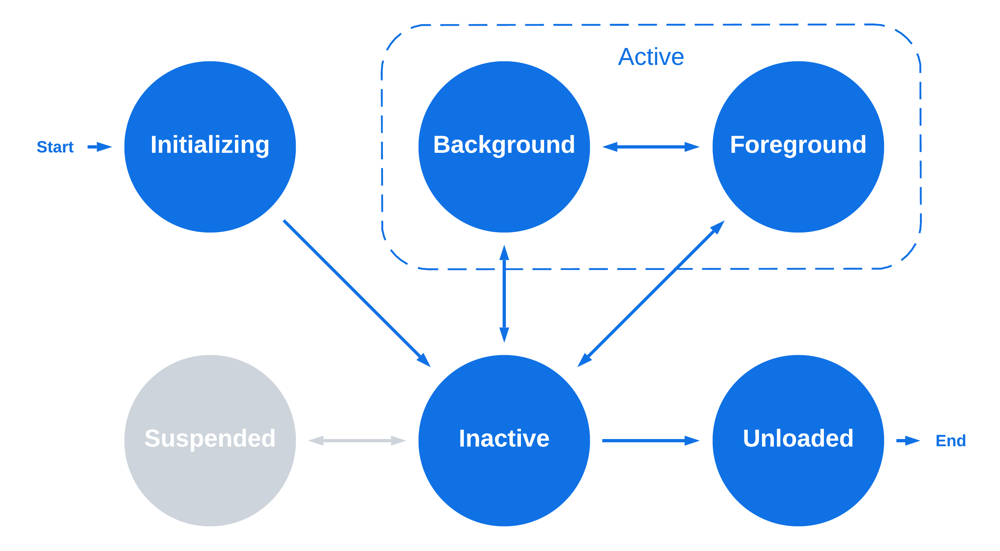

# App Lifecycle Management

Document Status: Proposed Specification

See [Firebolt Requirements Governance](../../governance.md) for more info.

| Contributor    | Organization   |
| -------------- | -------------- |
| Andrew Bennet            | Sky            |
| Tim Dibben            | Sky            |
| Jeremy LaCivita            | Comcast            |
| Kevin Pearson            | Comcast            |
| Peter Yu            | Comcast           |

## 1. Overview

This document describes the requirements that Firebolt platforms must
fulfill when managing App Lifecycles. *App Lifecycle* refers to the
lifecycle of an individual app from the time it is launched/loaded to
the time it is unloaded and all runtime resources are discarded.

*Loading* an app refers to fetching the initial resources, e.g. the
app-manifest and index.html, and loading them into a container capable
of running the app, e.g. a web browser.

*Launching* an app refers to the process of getting an app into a state
where it is some part of the user experience (e.g. visible, audible, or
responding to input). This may include *loading* the app first, if
needed.

*Closing* an app refers to the process of getting an app out of a state
where it is the primary user experience (e.g not visible, not audible,
and not responding to input). This **does not** involve *unloading* the
app.

*Unloading* an app refers to the process of notifying an app to do any
needed clean up, and then *terminating* it.

*Terminating* an app refers to shutting down the app's container and
reclaiming any memory, CPU, etc. that it was consuming.

- [1. Overview](#1-overview)
- [2. Lifecycle States](#2-lifecycle-states)
  - [2.1. Initializing](#21-initializing)
  - [2.2. Inactive](#22-inactive)
  - [2.3. Foreground](#23-foreground)
  - [2.4. Background](#24-background)
  - [2.5. Unloading](#25-unloading)
  - [2.6. Suspended](#26-suspended)
- [3. Lifecycle State Transitions](#3-lifecycle-state-transitions)
  - [3.1. Loading an app](#31-loading-an-app)
  - [3.2. Launching an app](#32-launching-an-app)
  - [3.3. Closing an app](#33-closing-an-app)
  - [3.4. Backgrounding an app](#34-backgrounding-an-app)
  - [3.5. Suspending an app](#35-suspending-an-app)
  - [3.6. Unsuspending an app](#36-unsuspending-an-app)
  - [3.7. Unloading an app](#37-unloading-an-app)
  - [3.8. Terminating an app](#38-terminating-an-app)
- [4. Core SDK APIs](#4-core-sdk-apis)
  - [4.1. Ready](#41-ready)
  - [4.2. Close](#42-close)
  - [4.3. Finished](#43-finished)
  - [4.4. State](#44-state)
- [5. Lifecycle Configuration](#5-lifecycle-configuration)

## 2. Lifecycle States

Firebolt platforms **MUST** support running one or more apps
concurrently. The platform **MUST** manage transition of apps from state
to state.

A Firebolt app, once running, **MAY** be in one of several states and
**MUST NOT** be in more than one state at a time.

|              | CPU | Active | Visible | RCU | AV  | Description                                                                   |
|-----------|-------|-------|-------|-------|-------|---------------------------|
| Initializing | ✔   |        |         |     |     | App is preparing to be minimally usable.                                      |
| Inactive     | ✔   |        |         |     |     | App is ready for use, but not part of the user experience.                    |
| Foreground   | ✔   | ✔      | ✔       | ✔   | ✔   | App is the primary user experience.                                           |
| Background   | ✔   | ✔      | ✔\*     | ✔\* | ✔   | App is a secondary user experience, e.g. covered by a system modal.           |
| Unloading    | ✔   |        |         |     |     | App will be unloaded soon.                                                    |
| Suspended    |     |        |         |     |     | App state is being persisted to storage and will be stop running immediately. |

*\*Background apps may or may not be visible and/or receive input*

### 2.1. Initializing

This state allows apps to do whatever initialization is required in
order to be a Firebolt compliant app, e.g. register for event listeners,
etc.

When an app is first loaded the platform **MUST** consider it to be in
the initializing state. Apps **MUST** remain in this state until they
register with the platform via Lifecycle.ready(), or
Lifecycle.onInactive(), or are unloaded by the platform.

The platform **MUST NOT** ever put an app back into this state once it
has left unless it has been unloaded and then loaded again.

There is no notification for this state, it just is.

### 2.2. Inactive

This state allows an app to be running, but not in one of the two active
states, i.e. foreground and background. Inactive apps can execute code,
but are not visible, do not receive any input from RCUs, and cannot use
the video decoder. Apps should free up memory and other resources in
this state.

When an app transitions to this state, the platform **MUST** dispatch
the Lifecycle.onInactive notification with the current state and
previous states.

Apps in this state **MUST** not use the media pipeline and the platform
**MUST** tear down any Media Pipeline sessions associated with this app.

When an app is initializing, and registers for Lifecycle.onInactive
notifications, the platform **MUST** transition the app to the inactive
state with the previous state set to initializing, since it is now able
to execute any code related to that transition.

If an app is still initializing, and calls Lifecycle.ready(), the
platform **MUST** transition the app to the inactive state with the
previous state set to initializing.

When an app is in either *active* state and is *closed* then the
platform **MUST** transition the app to the inactive state with the
previous and current state set correctly.

When an app is in the suspended state and is then unsuspended, then the
platform **MUST** transition the app to the inactive state with the
previous state set to suspended.

### 2.3. Foreground

This state allows an app to be presented as the primary experience to
the user.

The platform **MUST** ensure that only one or zero apps is ever in this
state at one time.

Apps in this state **MUST** be visible.

Apps in this state **MUST** receive RCU key presses that they have
permissions for.

Apps in this state **MUST** have access to the audio-video decoder.

Apps in this state **SHOULD NOT** have performance negatively impacted
by other processes on the device.

When an app transitions to this state, the platform **MUST** dispatch
the Lifecycle.onForeground notification with the current state and
previous states.

### 2.4. Background

This state allows an app to be present as the secondary experience to
the user, e.g. when a system settings UI is overlayed on top of the app.

Different platforms **MAY** support differing numbers of backgrounded
apps.

Apps in this state **MUST** either be partially visible **OR** have
access to an audio decoder, e.g. an app playing music in the background.

Apps in this state **SHOULD NOT** receive most RCU key presses, although
platforms **MAY** forward certain keys to the app, e.g. play/pause keys.

Apps in this state **MAY** have access to the audio-video decoder. How
many decoders are available is a decision for each device based on
resources.g

Apps in this state **SHOULD NOT** have performance negatively impacted
by other processes on the device.

When an app transitions to this state, the platform **MUST** dispatch
the Lifecycle.onBackground notification with the current state and
previous states.

### 2.5. Unloading

This state allows apps to do whatever cleanup is required in order to be
a Firebolt compliant app, e.g. unregister for event listeners, clean up
timers, post any final business analytics, etc.

When an app is about to be unloaded the platform **MUST** transition it
to this state. Apps **MUST** remain in this state until they notify the
platform via Lifecycle.finished(), or are unloaded by the platform after
appFinishedTimeout milliseconds have passed.

The platform **MUST NOT** ever put an app into any other state once it
is in the unloading state unless it has been unloaded and then loaded
again.

### 2.6. Suspended

This state allows an app to be copied from memory to local storage and
then terminated to save resources. Subsequently, the app may be copied
back into memory, and resume in the same state.

Apps **MUST** be able to subscribe to the Lifecycle.onSuspended
notification without errors regardless of whether the platform supports
suspending apps. For platforms that do not support it the notification
will just never fire.

*If* a platform does not support suspending apps, then the following
requirements **MUST NOT** be fulfilled, even partially. A platform
**MUST NOT** use the APIs documented here to implement an alternate,
non-compliant version of the app suspending feature.

*If* a platform supports suspending apps, then the following
requirements **MUST** be fulfilled.

Apps **MUST** only enter this state from the inactive state.

*Immediately before* an app transitions to this state, the platform
**MUST** dispatch the Lifecycle.onSuspended notification with the
current state and previous states.

The platform **MUST** save the app's memory space at this point, so that
it may be unsuspended later. If storing the app\'s memory space fails
for any reason, then the app **MUST** be treated as though it were
unloaded.

Finally, the app and its container **MUST** be removed from memory and
have other resources released as well.

## 3. Lifecycle State Transitions

Firebolt platforms **MUST** support the app lifecycle states and
transitions denoted in blue.

Platforms **MAY** support the app lifecycle states and transitions
denoted in gray.

Platforms **MUST NOT** support any other states or transitions not in
this diagram.

Platforms **MAY** terminate an app and/or it's container process at any
time for operational reasons, e.g. an app becomes non-responsive. This
is left out of the diagram for simplicity.

### 3.1. Loading an app

Loading an app fetches the initial resources, e.g. the app-manifest and
index.html, and loads them into a container capable of running the app,
e.g. a web browser.

The platform may load apps for any number of reasons that are out of
scope for this document.

Loading an app requires the platform to know the URL to the app's
Firebolt manifest.

To load an app, platforms **MUST** use the following process.

First, fetch the app manifest and validate its signature (See 'App
Manifests' for more info).

The app **MUST** be terminated if the signature is not valid and the
manifest's releaseStatus is not developer.

Next, if the app is an HTML/JavaScript app, then load the app's initial
URL (from the app manifest) into the browser.

The Firebolt SDK will enforce that the app is in the initializing state
when the app first loads.

If the app begins listening for the onInactive event during the
initializing state, then the platform **MUST** transition the app into
the inactive state.

The loading() API may only be called during an apps first time in the
inactive state. This API returns an error at all other times.

Finally, wait for up to appReadyTimeout milliseconds for the app to call
the ready() API. Apps that do not call Lifecycle.ready() within the
timeout **MUST** be terminated. Once the app calls Lifecycle.ready(),
apps that are in the initializing state **MUST** be transitioned to the
inactive state within 500 milliseconds. See Launching an App for more
info.

The ready() API may only be called during the initializing state, or
during an apps first time in the inactive state.

### 3.2. Launching an app

Launching an app transitions it to one of the *active* states
(foreground or background) so that it becomes part of the user's
experience.

The platform may launch apps for any number of reasons that are out of
scope for this document.

One app **MAY** request to launch another app, via the
Discovery.launch() API method, see
[Discovery](#).

**TODO**: Add this spec so we can link to it!

To launch an app, platforms **MUST** use the following process.

If the app is already in the foreground state, then it is already
launched and there is no need to do anything else. The platform **MUST
NOT** dispatch any *additional* lifecycle notifications when attempting
to launch an app that is already in the foreground state and the
remainder of this section does not need to happen.

If the app is not loaded, then it **MUST** be fully *loaded*, i.e.
Lifecycle.ready() has been called, first.

If the app is suspended, then it **MUST** be *unsuspended* first.

At this point, the app **MUST** be in either the inactive or background
state.

Finally, the platform **MUST** transition the app to intended state,
either the foreground or background state (see
'[Foreground](#23-foreground)' and 'Background' above).

### 3.3. Closing an app

Closing an app transitions it to the inactive state, so that it is no
longer part of the user's experience.

The platform may close apps for any number of reasons that are out of
scope for this document.

Apps **MAY** request to be closed, via the Lifecycle.close() API method.

To close an app, platforms **MUST** use the following process.

If an app is already in the inactive state, then it is already closed
and there is no need to do anything else. The platform **MUST NOT**
dispatch any *additional* lifecycle notifications when attempting to
close an app that is already in the inactive state and the remainder of
this section does not need to happen.

If the app is not loaded, or is in the unloading, suspended, or
initializing state, then it cannot be closed, and the remainder of this
section does not need to happen.

Finally the platform transitions the app to the inactive state.

### 3.4. Backgrounding an app

Backgrounding an app transitions it to the background state, so that it
is no longer the user experience.

The platform may background apps for any number of reasons that are out
of scope for this document.

To background an app, platforms **MUST** use the following process.

If an app is already in the background state, then it is already
backgrounded and there is no need to do anything else. The platform
**MUST NOT** dispatch any *additional* lifecycle notifications when
attempting to background an app that is already in the background state
and the remainder of this section does not need to happen.

If the app is not loaded, or is in the unloading, suspended, or
initializing state, then it cannot be backgrounded, and the remainder of
this section does not need to happen.

At this point, the app **MUST** be in either the foreground or inactive
state.

Finally, the platform **MUST** transition the app to the background
state (see '[Background](#24-background)' above).

### 3.5. Suspending an app

Suspending an app transitions it to the suspended state, so that it is
no longer using resources on the device.

The platform may suspend apps for any number of reasons that are out of
scope for this document. However, it is the platform's decision to
suspend an app, not the app itself.

To suspend an app, platforms **MUST** use the following process.

If an app is already in the suspended state, then it is already
suspended and there is no need to do anything else. The platform **MUST
NOT** dispatch any *additional* lifecycle notifications when attempting
to suspend an app that is already in the suspended state and the
remainder of this section does not need to happen.

If the app is not loaded, or is not in the inactive state, then it
cannot be suspended, and the remainder of this section does not need to
happen.

At this point, the app **MUST** be in the inactive state.

Finally the platform **MUST** transition the app to the
suspended state (see '[Suspended](#26-suspended)' above).

### 3.6. Unsuspending an app

Unsuspending an app loads it's previous state back into memory and
transitions it to the inactive state, so that it may be launched back
into its original state.

The platform may unsuspend apps for any number of reasons that are out
of scope for this document.

To unsuspend an app, platforms **MUST** use the following process.

If an app is not in the suspended state, then it cannot be unsuspended
and there is no need to do anything else. The platform **MUST NOT**
dispatch any *additional* lifecycle notifications when attempting to
unsuspend an app that is not in the suspended state and the remainder of
this section does not need to happen.

At this point, the app **MUST** be in the suspended state.

Next, the platform **MUST** load the app's saved memory state back into
a browser container. If this fails for any reason then the unsuspend
operation failed and should error out and the app **MUST** be considered
unloaded. Additionally, the app **MUST** be removed from the list of
suspended apps, so that an unsuspend operation is not attempted again.

Finally, the platform **MUST** transition the app to the inactive state
(see '[Inactive](#22-inactive)' above).

### 3.7. Unloading an app

Unloading an app transitions it out of memory, so that it is no longer
using resources on the device.

The platform may unload apps for any number of reasons that are out of
scope for this document.

To unload an app, platforms **MUST** use the following process.

If an app is not in the inactive state, then it cannot be unloaded and
there is no need to do anything else. The platform **MUST NOT** dispatch
any *additional* lifecycle notifications when attempting to unload an
app that is not in the inactive state and the remainder of this section
does not need to happen.

At this point, the app **MUST** be in the inactive state.

Finally the platform **MUST** transition the app to the
unloading state (see '[Unloading](#25-unloading)' above).

### 3.8. Terminating an app

Terminating an app removes it from memory without dispatching any state
changes.

The platform may terminate apps for any number of reasons that are out
of scope for this document, e.g. an app becomes non-responsive.

Terminating an app results in removing it from memory and all resources
held by the app and it's container being freed up.

Platforms **MAY** terminate an app when needed but **SHOULD NOT** do
this in place of graceful unloading.

## 4. Core SDK APIs

The following APIs are exposed by the Firebolt Core SDK.

See the [Firebolt API
Documentation](https://developer.comcast.com/firebolt/core/sdk/latest/api/)
for details around syntax, etc.

### 4.1. Ready

The Lifecycle.ready() API allows an app to notify the platform that it
is initialized and ready to be displayed to the end user. This method
**MUST NOT** be called more than once.

### 4.2. Close

The Lifecycle.close() API allows an app to request that it be closed by
the platform.

This method requires a reason parameter, which tells the platform why
the app is requesting to be closed:

Lifecycle.appReadyTimeout

| Reason                    | Description                                                                                                                                                              |
|------------------------------------|------------------------------------|
| CloseReason.REMOTE_BUTTON | The user pressed the back or last button on the RCU and the App has determined it is at the top of it's navigation stack and should go back to the platform home screen. |
| CloseReason.USER_EXIT     | The user selected an exit control exposed by the app's UI.                                                                                                               |
| CloseReason.ERROR         | The app is experiencing unrecoverable issues and needs to be closed and unloaded.                                                                                        |

Platforms generally **SHOULD** respect this call and move the app to the
inactive state, but there may be edge cases where this is not possible,
e.g. the app is considered to be the default experience for the device,
and closing it would leave no other UX present.

When the request to close is not respected, the Lifecycle.close() method
**MUST** return an error.

Platforms **MAY** prioritize apps to be unloaded based on the reason
provided. For example, apps closed due to the RCU are less likely to be
unloaded since it may be an accidental RCU press, whereas an explicit
user exit is more likely to be intentional.

### 4.3. Finished

The Lifecycle.finished() API allows an app to notify the platform that
it is done preparing to be unloaded.

This allows the platform to unload the app *before* appFinishedTimeout
milliseconds have passed, so that apps can be unloaded faster.

The platform **MUST** unload an app after appFinishedTimeout
milliseconds even if this method is never called.

This method results in an error if it is called while the app is in any
other state than unloading, or called more than once while in that
state.

### 4.4. State

The Lifecycle.state() method provides convenient access to the current
state, and is implemented by the Core SDK listening to all state
notifications. This method **MUST NOT** be asynchronous.

## 5. Lifecycle Configuration

In order to enable Firebolt Certification of a device's Lifecycle
Management features, the device **MUST** support the following
configuration options, so that the Firebolt Certification Test Suite
knows which optional conditions to test for, and for how long to wait
for state transitions.

The LifecyclePolicy fields are:

| Field              | Type   | Required | Description                                                                                                                                                                                      |
|-------------------|-------|----------|-------------------------------------|
| appReadyTimeout    | bigint | Yes      | Number of milliseconds the platform should wait before terminating a loaded app that did not call ready().                                                                                       |
| appFinishedTimeout | bigint | Yes      | Number of milliseconds the platform should wait after dispatching the onUnloading notification before finally unloading an app that did not call finished().                                     |
| appSuspendTimeout  | bigint | Yes      | Number of milliseconds the platform should wait after dispatching the onRequestSuspend notification before finally suspending (or terminating) an app that did not call onSuspendResponse().     |
| appInactiveTimeout | bigint | Yes      | Number of milliseconds the platform should wait after dispatching the onRequestInactive notification before finally inactivating (or terminating) an app that did not call onInactiveResponse(). |
