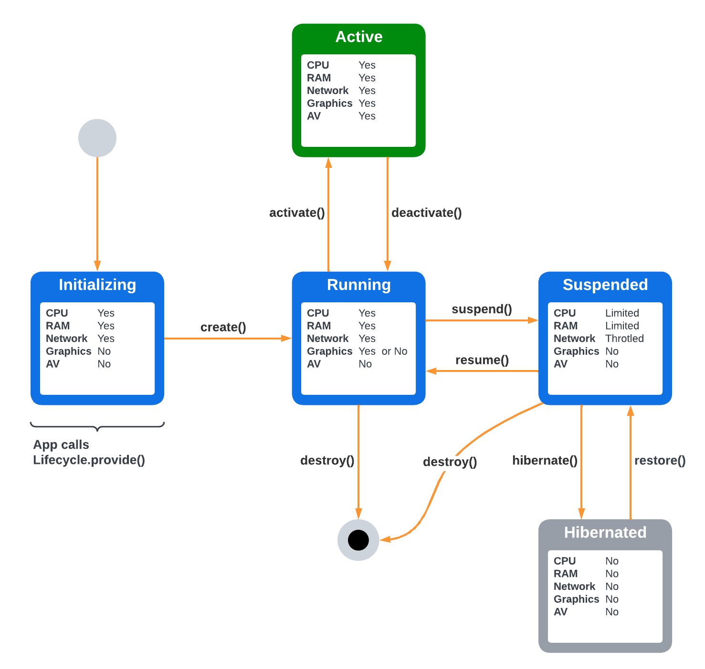

# App Lifecycle Management

Document Status: Working Draft

See [Firebolt Requirements Governance](../../governance.md) for more info.

| Contributor    | Organization   |
| -------------- | -------------- |
| Andrew Bennet            | Sky            |
| Cody Bonney   | Charter |
| Bart Catrysse            | Liberty           |
| Tim Dibben            | Sky            |
| Jeremy LaCivita            | Comcast            |
| Ramprasad Lakshminarayana | Sky |
| Kevin Pearson            | Comcast            |
| Peter Yu            | Comcast           |


## 1. Overview

This document describes the requirements that Firebolt platforms must
fulfill when managing App Lifecycles. *App Lifecycle* refers to the
lifecycle of an individual app from the time it is launched/loaded to
the time it is unloaded and all runtime resources are discarded.

*Loading* an app refers to fetching the initial resources, e.g. the
app-manifest and index.html, and loading them into a container capable
of running the app, e.g. a web browser.

*Launching* an app refers to the process of getting an app into a state
where it is presented as a primary part of the user experience (e.g.
visible, audible, or responding to input). This may include *loading*
the app first, if needed. For details on presentation, see [App
Presentation](./presentation.md).

*Closing* an app refers to the process of getting an app out of a state
where it is the primary user experience (e.g not visible, not audible,
and not responding to input). This **does not** involve *unloading* the
app.

*Unloading* an app refers to the process of notifying an app to do any
needed clean up, and then *terminating* it.

*Terminating* an app refers to shutting down the app's container and
reclaiming any memory, CPU, etc. that it was consuming.

*Suspending* an app refers to reducing the app's memory usage and CPU
cycles, and deallocating its graphics compositors so that other apps
will have more resources available.

*Resuming* an app refers to reallocating its graphics compositors and
resuming normal CPU and memory allocations.

*Sleeping* an app refers to turning off all CPU cycles for that app
and possibly copying the app's memory stack out of RAM so it may be
revived later.

*Waking* an app refers to copying a Sleeping app back into the
memory space of a compatible process so that it resumes where it left
off.

- [1. Overview](#1-overview)
- [2. Lifecycle States](#2-lifecycle-states)
  - [2.1. Initializing](#21-initializing)
  - [2.2. Running](#22-running)
  - [2.3. Active](#23-active)
  - [2.4. Suspended](#24-suspended)
  - [2.5. Sleeping](#25-sleeping)
- [3. Lifecycle State Transitions](#3-lifecycle-state-transitions)
  - [3.1. Loading an app](#31-loading-an-app)
  - [3.2. Initializing an app](#32-initializing-an-app)
  - [3.3. Activating an app](#33-activating-an-app)
  - [3.4. Deactivating an app](#34-deactivating-an-app)
  - [3.5. Suspending an app](#35-suspending-an-app)
  - [3.6. Resuming an app](#36-resuming-an-app)
  - [3.7. Putting an app to sleep](#37-putting-an-app-to-sleep)
  - [3.8. Waking an app from sleep](#38-waking-an-app-from-sleep)
  - [3.9. Unloading an app](#39-unloading-an-app)
  - [3.10. Terminating an app](#310-terminating-an-app)
- [4. Core SDK APIs](#4-core-sdk-apis)
  - [4.1. LifecycleManagement Interface](#41-lifecyclemanagement-interface)
  - [4.2. Ready](#42-ready)
  - [4.3. Close](#43-close)
  - [4.4. State](#44-state)
- [5. Lifecycle Configuration](#5-lifecycle-configuration)


## 2. Lifecycle States
Firebolt platforms **MUST** support running one or more apps
concurrently. The platform **MUST** manage transition of apps from state
to state.

A Firebolt app, once running, **MUST** be in one of several states and
**MUST NOT** be in more than one state at a time.

As an app changes states, events are dispatched notifying the app of
it's current and previous state. These events are for reacting to each state.

For information on *influencing* state transitions, see [State Transitions](#3-lifecycle-state-transitions).


|              | CPU | RAM | F/S | Net | GFX | A/V | Description                                                                |
|--------------|-----|-----|-----|-----|-----|-----|----------------------------------------------------------------------------|
| Initializing | ✔   | ✔   | ✔   | ✔   |     |     | Started executing, but is not yet instantiated as a Firebolt app.          |
| Running      | ✔   | ✔   | ✔   | ✔   | ✔   |     | Full access to resources, except A/V, and registered as a Firebolt app.    |
| Active       | ✔   | ✔   | ✔   | ✔   | ✔   | ✔   | Full access to resources and is a perceptible part of the user experience. |
| Suspended    | ↓   | ↓   | ✔   | ✔   |     |     | Reduced memory footprint and no access to graphics or A/V.                 |
| Sleeping     |     | ?   |     |     |     |     | No CPU cycles are given to the app. App may stay in RAM or be stored.      |

|   | Legend |
| - | ------ | 
| ↓ | Limited |
| ✔ | Normal access |
| ? | Unknown | 

### 2.1. Initializing
TBD...

### 2.2. Running

This state allows an app to be running and ready to go, but not actively
of the user-perceptible experience.

Running apps can execute code, but are not [Presented](./presentation.md) to the user, do not receive
any input from RCUs, and cannot use the video decoder.

Apps in this state **MUST** have access to the graphics compositor.

Apps in this state **MUST NOT** be visible.

Apps in this state **MUST NOT** receive RCU key presses.

Apps in this state **MUST NOT** have access to the audio-video decoder.

When an app transitions to this state, the platform **MUST** dispatch
the `Lifecycle.onRunning` notification with the current state and
previous states.

Apps in this state **MUST NOT** use the media pipeline and the platform
**MUST** tear down any Media Pipeline sessions associated with this app.

### 2.3. Active

This state allows an app to be presented as part of the user-perceptible
experience.

To determine if an app is the *primary* experience, e.g. fullscreen,
etc., see [Presentation](./presentation.md).

It is a platform decision as to how many apps may be in this state at
once.

Apps in this state **MAY** be visible.

Apps in this state **MAY** receive RCU key presses that they have
permissions for.

Apps in this state **MUST** have access to the audio decoder if
they have permission to the `xrn:firebolt:capability:decoder:audio`
capability and the platform has an available software or hardware
decoder.

Apps in this state **MUST** have access to the video decoder if
they have permission to the `xrn:firebolt:capability:decoder:video`
capability and the platform has an available software or hardware
decoder.

Apps in this state **MUST** have access to the graphics compositor.

Apps in this state **SHOULD NOT** have performance negatively impacted
by other processes on the device.

Apps in this state **SHOULD** use less than XXX megabytes of RAM.

**TODO**: do we want tiers of apps? per-app config?

When an app transitions to this state, the platform **MUST** dispatch
the `Lifecycle.onActive` notification with the current state and
previous states.


### 2.4. Suspended

This state allows an app to remain in memory and consume fewer resources.

Suspended apps can execute code, but are not [Presented](./presentation.md) to the user, do not receive
any input from RCUs, and cannot use the video decoder.

Apps in this state **MUST NOT** have access to the graphics compositor.

Apps in this state **MUST NOT** be visible.

Apps in this state **MUST NOT** receive RCU key presses.

Apps in this state **MUST NOT** have access to the audio-video decoder.

Apps in this state **SHOULD NOT** have performance negatively impacted
by other processes on the device.

Apps in this state **SHOULD** use less than XXX megabytes of RAM.

**TODO**: do we want tiers of apps? per-app config?

When an app transitions to this state, the platform **MUST** dispatch
the `Lifecycle.onSuspended` notification with the current state and
previous states.

### 2.5. Sleeping

This state allows an app to be copied from memory to local storage and
then terminated to save resources. Subsequently, the app may be copied
back into memory, and resume in the same state.

Apps **MUST** be able to subscribe to the Lifecycle.onSleeping
notification without errors regardless of whether the platform supports
suspending apps. For platforms that do not support it the notification
will just never fire.

*If* a platform does not support the
`xrn:firebolt:capability:lifecycle:sleep`, then the following
requirements **MUST NOT** be fulfilled, even partially. A platform
**MUST NOT** use the APIs documented here to implement an alternate,
non-compliant version of the app sleeping feature.

*If* a platform supports the `xrn:firebolt:capability:lifecycle:sleep`
capability, then the following requirements **MUST** be fulfilled.

Apps **MUST** only enter this state from the `RUNNING` state, via the `suspend()` interface.

*Immediately before* an app transitions to this state, the platform
**MUST** dispatch the Lifecycle.onSleeping notification with the
current state and previous states.

The platform **MUST** save the app's memory space at this point, so that
it may be unsuspended later. If storing the app\'s memory space fails
for any reason, then the app **MUST** be treated as though it were
unloaded.

Finally, the app and its container **MUST** be removed from memory and
have other resources released as well.

## 3. Lifecycle State Transitions
**TODO**: write words about only one transition will be called on an app at a time...

There are several state transitions where the app and the platform need
to interact to ensure the transition goes smoothly.

By providing an implementation of the
`xrn:firebolt:capability:lifecycle:management` interface, an app can
influence how resources are managed during these state transitions. See [LifecycleManagement Interface](#41-lifecyclemanagement-interface) for more info.



|              | CPU | RAM | Net | GFX | A/V | Description                                                                   |
|--------------|-----|-----|-----|-----|-----|-------------------------------------------------------------------------------|
| create()     | ✔   | ✔   | ✔   | ✔   |     | Creation of the app, from a Firebolt Lifecycle perspective.                   |
| activate()   | ✔   | ✔   | ✔   | ✔   | ✔   | App is expected to become a user-perceptible part of the user experience.     |
| deactivate() | ✔   | ✔   | ✔   | ✔   | ✔   | Must remove any user-perceptible activities and deallocate A/V decoders.      |
| suspend()    | ✔   | ✔   | ✔   | ✔   |     | Reduce memory usage and CPU cycles, deallocate graphics compositors.          |
| resume()     | ✔   | ✔   | ✔   | ✔   |     | Graphics compositors reallocated, full memory usage and normal CPU cycles.    |
| sleep()      | ↓   | ↓   | ✔   |     |     | Prepare for an extended period with no CPU cycles given to app.               |
| wake()       | ↓   | ↓   | ✔   |     |     | Cleanup after an extended period with no CPU, e.g. reset timers / network connections.   |
| destroy()    | ✔/↓ | ✔/↓ | ✔   |     |     | Preprare for the app to be deallocated and removed from execution. CPU & RAM based on previous state. |

|   | Legend |
| - | ------ | 
| ↓ | Limited |
| ✔ | Normal access |

### 3.1. Loading an app

**TODO**: Should this be it's own spec, and out of scope?

Loading an app fetches the initial resources, e.g. the app-manifest and
index.html, and loads them into a container capable of running the app,
e.g. a web browser.

The platform may load apps for any number of reasons that are out of
scope for this document.

Loading an app requires the platform to know the URL to the app's
Firebolt manifest.

To load an app, platforms **MUST** use the following process.

First, fetch the app manifest and validate its signature (See 'App
Manifests' for more info).

The app **MUST** be terminated if the signature is not valid and the
manifest's releaseStatus is not developer.

Next, if the app is an HTML/JavaScript app, then load the app's initial
URL (from the app manifest) into the browser.

**TODO**: add more details here, e.g. containers, graphics, media pipeline, ram

### 3.2. Initializing an app
Once an app is loaded it **MUST** be initialized immediately.

Initialzing consists of three parts:

- Any code that automatically runs within the app executable
- Registration of the Firebolt LifecycleManagement provider
- Invoking the app's LifecycleManagement.create() method

If an app does not provide the `xrn:firebolt:capability:lifecycle:management`
capability within `initializeTimeout` milliseconds, then the platform **MUST**
terminate the app.

Otherwise, the platform **MUST** call the app's implementation of
`LifecycleManagement.create()`:

> The platform **MUST** dispatch the `Lifecycle.onRequestCreate`
> notification to the app, and wait for `appCreateTimeout` milliseconds
> for either a `Lifecycle.createResult` or `Lifecycle.createError` call in
> response.
>
> Once the platform receives the `createResult` call, then the app
> is considered to have any important Firebolt notifications set up
> and is ready to be activated and presented to the user.
>
> If the app times out or makes a `createError` call, then the app
> **MUST** be terminated.

Apps **SHOULD** set up any Firebolt event listeners either before calling
`Lifecycle.provide` or during `create()`, since the platform will wait until
the app is ready before dispatching many critical events such as Lifecycle
and Presentation events.

Apps **SHOULD** acquire any important authentication needed for the
app to function during initialization.

Apps **MAY** load a limited set of global display resources, e.g. a
global style sheet or a logo used throughout the experience, during
initialization.

**TODO**: discuss this ^^

Once the `create` method returns the app **MUST** be transitioned to
the `RUNNING` state within 100 milliseconds.

**TODO** Discuss ^^

### 3.3. Activating an app

Launching an app transitions it to the `ACTIVE` state so that it becomes part
of the user's experience.

**TODO**: is graphics available at beginning of activate?
**TODO**: Outline when RAM/CPU/GRAPHICS, etc. becaome available for each transition, e.g. start vs end
**TODO**: rename "suspended" to "Low Resource".

The platform may launch apps for any number of reasons that are out of
scope for this document.

To launch an app, platforms **MUST** use the following process.

**TODO**: Write words about how you can't activate two apps into "foreground" at the same time.

If the app is already in the `ACTIVE` state, then it is already
launched and there is no need to do anything else. The platform **MUST
NOT** dispatch any *additional* lifecycle notifications when attempting
to launch an app that is already in the foreground state and the
remainder of this section does not apply.

If the app is not loaded, then the platform **MUST** [load](#31-loading-an-app) it first.

If the app is not initialized, the platform **MUST** [initialize](#32-initializing-an-app) it first.

If the app is suspended, then it **MUST** be [resumed](#37-resuming-an-app) first.

At this point, the app **MUST** be in the `RUNNING` state.

If an app provides the `xrn:firebolt:capability:lifecycle:management`
capability, then the platform **MUST** call the app's implementation of
`LifecycleManagement.activate()`:

> The platform **MUST** dispatch the `Lifecycle.onRequestActivate`
> notification to the app, and wait for `appActivateTimeout` milliseconds
> for either a `Lifecycle.activateResult` or `Lifecycle.activateError`
> call in response.
>
> The `onRequestActivate` call **MUST** include a `NavigationIntent`.
>
> Once the platform receives the `activateResult` call, then the app
> may be moved to the `ACTIVE` state.
>
> If the app times out or makes an `activateError` call, then the app
> **MUST** be terminated.

### 3.4. Deactivating an app

Closing an app transitions it to the `RUNNING` state, so that it is no
longer part of the user's experience.

The platform may close apps for any number of reasons that are out of
scope for this document.

Apps **MAY** request to be closed, via the `Lifecycle.close()` API method.

To close an app, platforms **MUST** use the following process.

If an app is already in the `RUNNING`, `SUSPENDED`, or `SLEEPING` state, then it is already closed
and there is no need to do anything else. The platform **MUST NOT**
dispatch any *additional* lifecycle notifications when attempting to
close an app that is already in the `RUNNING` state and the remainder of
this section does not apply.

If an app is in the `initializing` state, then it is not 

If an app is already performing a `deactivate()` transition, the platform
**MUST** ignore the new attempt to close the app, allow the pending
closure to complete, and the remainder of this section does not apply.

If an app is already performing an `activate()` transition, the platform
**MUST** wait for the activate call to succeed or fail and then skip the
remaining [activation steps](#33-activating-an-app).

If an app is currently [initializing](#32-initializing-an-app), the
platform **MUST** wait for initialization to succeed or fail and then skip
any activation that may have been pending.

If an app is currently [unloading](#38-unloading-an-app) then the app 
cannot be closed and the platform **MUST NOT** close it, and the
remainder of this section does not apply.

At this point, the app **MUST** be in the `ACTIVE` state.

If an app provides the `xrn:firebolt:capability:lifecycle:management`
capability, then the platform **MUST** call the app's implementation of
`LifecycleManagement.deactivate()`:

> The platform **MUST** dispatch the `Lifecycle.onRequestDeactivate`
> notification to the app, and wait for `appDeactivateTimeout` milliseconds
> for either a `Lifecycle.deactivateResult` or `Lifecycle.deactivateError`
> call in response.
>
> Once the platform receives the `deactivateResult` call, then the app
> may be moved to the `RUNNING` state.
>
> If the app times out or makes a `deactivateError` call, then the app
> **MUST** be terminated.

### 3.5. Suspending an app

Suspending an app transitions it to the `SUSPENDED` state, so that it is
no longer using resources on the device.

The platform may suspend apps for any number of reasons that are out of
scope for this document. However, it is the platform's decision to
suspend an app, not the app itself.

To suspend an app, platforms **MUST** use the following process.

If an app is already in the `SUSPENDED` state, then it is already
suspended and there is no need to do anything else. The platform **MUST
NOT** dispatch any *additional* lifecycle notifications when attempting
to suspend an app that is already in the suspended state and the
remainder of this section does not apply.

If the app is not loaded, or is not in the `RUNNING` state, then it
cannot be suspended, and the remainder of this section does not need to
happen.

At this point, the app **MUST** be in the `RUNNING` state.

If an app provides the `xrn:firebolt:capability:lifecycle:management`
capability, then the platform **MUST** call the app's implementation of
`LifecycleManagement.suspend()`:

**TODO** What is different about STARTED vs SUSPENDED?
**TODO** Netflix needs a boolean in created (launch visible or launch invisible)

> The platform **MUST** dispatch the `Lifecycle.onRequestSuspend`
> notification to the app, and wait for `appSuspendTimeout` milliseconds
> for either a `Lifecycle.suspendResult` or `Lifecycle.suspendError`
> call in response.
>
> Once the platform receives the `suspendResult` call, then the app
> may be moved to the `SUSPENDED` state.
>
> If the app times out or makes a `suspendError` call, then the app
> **MUST** be [unloaded](#38-unloading-an-app).

If an app does not provide the capability, then it cannot be suspended
and the platform **MUST NOT** attempt to.

### 3.6. Resuming an app

Unsuspending an app loads it's previous state back into memory and
transitions it to the started state, so that it may be launched back
into its original state.

The platform may unsuspend apps for any number of reasons that are out
of scope for this document.

To unsuspend an app, platforms **MUST** use the following process.

If an app is not in the `SUSPENDED` state, then it cannot be unsuspended
and there is no need to do anything else. The platform **MUST NOT**
dispatch any *additional* lifecycle notifications when attempting to
unsuspend an app that is not in the `SUSPENDED` state and the remainder of
this section does not apply.

At this point, the app **MUST** be in the `SUSPENDED` state.

Next, the platform **MUST** load the app's saved memory state back into
an appropriate container. If this fails for any reason then the unsuspend
operation failed and should error out and the app **MUST** be considered
unloaded. Additionally, the app **MUST** be removed from the list of
suspended apps, so that an unsuspend operation is not attempted again.

Suspended apps **MUST** provide the  `xrn:firebolt:capability:lifecycle:management`
capability, so the platform **MUST** call the app's implementation of
`LifecycleManagement.resume()`:

The platform **MUST** dispatch the `Lifecycle.onRequestResume`
notification to the app, and wait for `appResumeTimeout` milliseconds
for either a `Lifecycle.resumeResult` or `Lifecycle.resumeError`
call in response.

Once the platform receives the `resumeResult` call, then the app
may be moved to the `RUNNING` state.

If the app times out or makes a `resumeError` call, then the app
**MUST** be terminated.

### 3.7. Putting an app to sleep
TBD

### 3.8. Waking an app from sleep
TBD

### 3.9. Unloading an app

Unloading an app transitions it out of memory, so that it is no longer
using resources on the device.

The platform may unload apps for any number of reasons that are out of
scope for this document.

To unload an app, platforms **MUST** use the following process.

If an app is not in the `RUNNING` state, then it cannot be unloaded and
there is no need to do anything else. The platform **MUST NOT** dispatch
any *additional* lifecycle notifications when attempting to unload an
app that is not in the `RUNNING` state and the remainder of this section
does not need to happen.

At this point, the app **MUST** be in the `RUNNING` state.

If an app provides the `xrn:firebolt:capability:lifecycle:management`
capability, then the platform **MUST** call the app's implementation of
`LifecycleManagement.unload()`:

> The platform **MUST** dispatch the `Lifecycle.onRequestUnload`
> notification to the app, and wait for `appUnloadTimeout` milliseconds
> for either a `Lifecycle.finished` or `Lifecycle.unloadError`
> call in response.
>
> Once the platform receives the `finished` call, then the platform
> may proceed with app unloading.
>
> If the app times out or makes an `activateError` call, then the app
> **MUST** be terminated.

If an app does not provide the capability, then:

> The platform **MUST** dispatch the `onUnloading` notification and
> wait `appUnloadTimeout` milliseconds for the app to call `Lifecycle.finished`
>
> When the `finished` call occurs, or the timeout is reached, the platform
> **MUST** unload and terminate the app.

### 3.10. Terminating an app

Terminating an app removes it from memory without dispatching any state
changes.

The platform **SHOULD** terminate apps when one of the transitions outlined
here fails for some reason, or if an app becomes non-responsesive.

Terminating an app results in removing it from memory and all resources
held by the app and it's container being freed up.

Platforms **MAY** terminate an app when needed but **SHOULD NOT** do
this in place of graceful [unloading](#38-unloading-an-app).

## 4. Core SDK APIs

The following APIs are exposed by the Firebolt Core SDK.

### 4.1. LifecycleManagement Interface
The `LifeCycleManagement` interface is implemented by Apps to provide resource management.

```typescript
interface LifecycleManagement {
  function create(params: LaunchParameters): Promise<void>;
  function activate(intent: NavigationIntent): Promise<void>;
  function deactivate(): Promise<void>;
  function suspend(): Promise<void>;
  function resume(): Promise<void>;
}
```

Example:

```typescript
import { Lifecycle } from '@firebolt-js/sdk'

class ExampleLifecycleManager implements Lifecycle.LifecycleManagement {
  function create(params: LaunchParameters): Promise<void> {
    const limitTracking:boolean = params.limitAdTracking
  }

  function activate(intent: NavigationIntent): Promise<void> {
    if (intent.action === "playback") {
      console.log("Deep link to playback of " + intent.data.entityId)
    }
  }

  function deactivate(): Promise<void> {
    // free up MSE
    video.src = ""
    video.load()
  }

  function suspend(): Promise<void> {
    // unload all images
    document.querySelectorAll("img").forEach((img:HTMLElement) => {
      img.parentElement.removeChild(img)
    })
  }

  function resume(): Promise<void> {
    // reload images
  }
}

Lifecycle.provide("xrn:firebolt:capability:lifecycle:management", new ExampleLifecycleManager())
```

See the [Firebolt API
Documentation](https://developer.comcast.com/firebolt/core/sdk/latest/api/)
for details around syntax, etc.

### 4.2. Ready

The Lifecycle.ready() API allows an app to notify the platform that it
is initialized and ready to be displayed to the end user. This method
**MUST NOT** be called more than once.

### 4.3. Close

The Lifecycle.close() API allows an app to request that it be closed by
the platform.

This method requires a reason parameter, which tells the platform why
the app is requesting to be closed:

| Reason                    | Description                                                                                                                                                              |
|------------------------------------|------------------------------------|
| CloseReason.REMOTE_BUTTON | The user pressed the back or last button on the RCU and the App has determined it is at the top of it's navigation stack and should go back to the platform home screen. |
| CloseReason.USER_EXIT     | The user selected an exit control exposed by the app's UI.                                                                                                               |
| CloseReason.ERROR         | The app is experiencing unrecoverable issues and needs to be closed and unloaded.                                                                                        |

Platforms generally **SHOULD** respect this call and move the app to the
started state, but there may be edge cases where this is not possible,
e.g. the app is considered to be the default experience for the device,
and closing it would leave no other UX present.

When the request to close is not respected, the Lifecycle.close() method
**MUST** return an error.

Platforms **MAY** prioritize apps to be unloaded based on the reason
provided. For example, apps closed due to the RCU are less likely to be
unloaded since it may be an accidental RCU press, whereas an explicit
user exit is more likely to be intentional.

### 4.4. State

The Lifecycle.state() method provides convenient access to the current
state, and is implemented by the Core SDK listening to all state
notifications. This method **MUST NOT** be asynchronous.

## 5. Lifecycle Configuration

TODO: do we want these to be per spec, per distributor, or per app?

In order to enable Firebolt Certification of a device's Lifecycle
Management features, the device **MUST** support the following
configuration options, so that the Firebolt Certification Test Suite
knows which optional conditions to test for, and for how long to wait
for state transitions.

The LifecyclePolicy fields are:

| Field              | Type   | Required | Description                                                                                                                                                                                      |
|-------------------|-------|----------|-------------------------------------|
| appReadyTimeout    | bigint | Yes      | Number of milliseconds the platform should wait before terminating a loaded app that did not call ready().                                                                                       |
| appFinishedTimeout | bigint | Yes      | Number of milliseconds the platform should wait after dispatching the onUnloading notification before finally unloading an app that did not call finished().                                     |
| appSuspendTimeout  | bigint | Yes      | Number of milliseconds the platform should wait after dispatching the onRequestSuspend notification before finally suspending (or terminating) an app that did not call onSuspendResponse().     |
| appStartedTimeout | bigint | Yes      | Number of milliseconds the platform should wait after dispatching the onRequestStarted notification before finally inactivating (or terminating) an app that did not call onStartedResponse(). |
