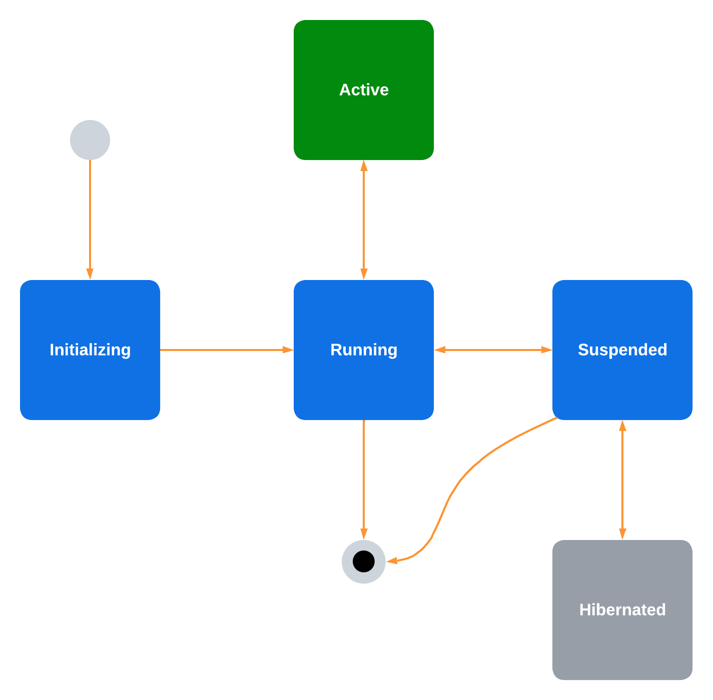

# App Lifecycle Management

Document Status: Working Draft

See [Firebolt Requirements Governance](../../governance.md) for more info.

| Contributor    | Organization   |
| -------------- | -------------- |
| Andrew Bennet            | Sky            |
| Cody Bonney   | Charter |
| Bart Catrysse            | Liberty           |
| Tim Dibben            | Sky            |
| Jeremy LaCivita            | Comcast            |
| Ramprasad Lakshminarayana | Sky |
| Kevin Pearson            | Comcast            |
| Peter Yu            | Comcast           |


## 1. Overview

This document describes the requirements that Firebolt platforms and
Firebolt applications must fulfill when managing App Lifecycles. *App
Lifecycle* refers to the lifecycle of an individual app from the time
it is launched/loaded to the time it is unloaded and all runtime
resources are discarded.

*Loading* an app refers to fetching the initial resources, e.g. the
app-manifest and index.html, and loading them into a container capable
of running the app, e.g. a web browser.

*Activating* an app refers to the process of getting an app into a state
where it is presented as part of the user-perceptible experience (e.g.
visible, audible, or responding to input). This may include *loading*
the app first, if needed. For details on presentation, see [App
Presentation](./presentation.md).

*Closing* an app refers to the process of getting an app out of a state
where it is the primary user experience (e.g not visible, not audible,
and not responding to input). This **does not** involve *unloading* the
app.

*Suspending* an app refers to reducing the app's memory usage and CPU
cycles, and deallocating its graphics compositors so that other apps
will have more resources available.

*Resuming* an app refers to reallocating its graphics compositors and
resuming normal CPU and memory allocations.

*Destroying* / unloading an app refers to the process of notifying an app to do any
needed clean up, and then *terminating* it.

*Terminating* an app refers to shutting down the app's container and
reclaiming any memory, CPU, etc. that it was consuming.

*Sleeping* an app refers to turning off all CPU cycles for that app
and possibly copying the app's memory stack out of RAM so it may be
revived later.

*Waking* an app refers to copying a Sleeping app back into the
memory space of a compatible process so that it resumes where it left
off.

- [1. Overview](#1-overview)
- [2. Lifecycle States](#2-lifecycle-states)
  - [2.1. Initializing](#21-initializing)
  - [2.2. Running](#22-running)
  - [2.3. Active](#23-active)
  - [2.4. Suspended](#24-suspended)
  - [2.5. Sleeping](#25-sleeping)
- [3. Getting the current state](#3-getting-the-current-state)
- [4. Lifecycle State Transitions](#4-lifecycle-state-transitions)
  - [4.1. Loading an app](#41-loading-an-app)
  - [4.2. Initializing an app](#42-initializing-an-app)
  - [4.3. Activating an app](#43-activating-an-app)
  - [4.4. Deactivating an app](#44-deactivating-an-app)
  - [4.5. Suspending an app](#45-suspending-an-app)
  - [4.6. Resuming an app](#46-resuming-an-app)
  - [4.7. Putting an app to sleep](#47-putting-an-app-to-sleep)
  - [4.8. Waking an app from sleep](#48-waking-an-app-from-sleep)
  - [4.9. Unloading an app](#49-unloading-an-app)
  - [4.10. Terminating an app](#410-terminating-an-app)
- [5. Getting the current status](#5-getting-the-current-status)
- [6. Activity Navigation](#6-activity-navigation)
- [7. Launch Parameters](#7-launch-parameters)
- [8. Core SDK APIs](#8-core-sdk-apis)
  - [8.1. Application Interface](#81-application-interface)
  - [8.2. Activity Interface](#82-activity-interface)
  - [8.3. Sleepable Interface](#83-sleepable-interface)
  - [8.4. Example App](#84-example-app)
  - [8.5. Ready](#85-ready)
  - [8.6. Close](#86-close)
  - [8.7. State](#87-state)
- [9. Lifecycle Configuration](#9-lifecycle-configuration)


## 2. Lifecycle States
Firebolt platforms **MUST** support running one or more apps
concurrently. The platform **MUST** manage transition of apps from state
to state.

A Firebolt app, once running, **MUST** be in one of several states and
**MUST NOT** be in more than one state at a time.

As an app changes states the platform will invoke specific app-provided transition methods, see [Transitions](#3-lifecycle-state-transitions), for more on this.



|              | CPU | RAM | F/S | Net | GFX | SFC | A/V | Description                                                                |
|--------------|-----|-----|-----|-----|-----|-----|-----|----------------------------------------------------------------------------|
| Initializing | ✔   | ✔   | ✔   | ✔   |     |     |     | Started executing, but is not yet instantiated as a Firebolt app.          |
| Running      | ✔   | ✔   | ✔   | ✔   | ✔   | ✔   |     | Full access to resources, except A/V, and registered as a Firebolt app.    |
| Active       | ✔   | ✔   | ✔   | ✔   | ✔   | ✔   | ✔   | Full access to resources and is a perceptible part of the user experience. |
| Suspended    | ↓   | ↓   | ✔   | ✔   |     |     |     | Reduced memory footprint and no access to graphics or A/V.                 |
| Sleeping     |     |     |     |     |     |     |     | No CPU cycles are given to the app. App may stay in RAM or be stored.      |

|   | Legend |
| - | ------ | 
| CPU | Central Processing Unit |
| RAM | Ramdon Access Memory |
| F/S | File System |
| Net | Network |
| GFX | Graphics rendering |
| SFC | Graphics compositor surface |
| A/V | Audio Video Decoder |
| ↓ | Limited |
| ✔ | Normal access |
| ? | Unknown | 

### 2.1. Initializing

This is the initial state an app exists from the moment it starts receiving CPU cycles.

When an app starts running is **MUST** initialize the Firebolt SDK as quickly as possible
and then wait for the `Application.create()` inteface to be called before doing further setup.

Apps in this state **MUST NOT** have access to the graphics compositor.

Apps in this state **MUST NOT** be visible.

Apps in this state **MUST NOT** receive RCU key presses.

Apps in this state **MUST NOT** have access to the audio-video decoder. 

Apps in this state **MUST NOT** use the media pipeline.

### 2.2. Running

This state allows an app to be running and ready to go, but not actively part
of the user-perceptible experience.

Running apps can execute code, but are not [Presented](./presentation.md) to the user, do not receive
any input from RCUs, and cannot use the video decoder.

Apps in this state **MUST** have access to the graphics compositor.

Apps in this state **MUST NOT** be visible.

Apps in this state **MUST NOT** receive RCU key presses.

Apps in this state **MUST NOT** have access to the audio-video decoder.

Apps in this state **MUST NOT** use the media pipeline and the platform
**MUST** tear down any Media Pipeline sessions associated with this app.

### 2.3. Active

This state allows an app to be presented as part of the user-perceptible
experience.

To determine if an app is the *primary* experience, e.g. fullscreen,
etc., see [Presentation](./presentation.md).

It is a platform decision as to how many apps may be in this state at
once.

Apps in this state **MAY** be visible.

Apps in this state **MAY** receive RCU key presses that they have
permissions for.

Apps in this state **MUST** have access to the audio decoder if
they have permission to the `xrn:firebolt:capability:decoder:audio`
capability and the platform has an available software or hardware
decoder.

Apps in this state **MUST** have access to the video decoder if
they have permission to the `xrn:firebolt:capability:decoder:video`
capability and the platform has an available software or hardware
decoder.

Apps in this state **MUST** have access to the graphics compositor.

Apps in this state **SHOULD NOT** have performance negatively impacted
by other processes on the device.

Apps in this state **SHOULD** use less than XXX megabytes of RAM.

**TODO**: do we want tiers of apps? per-app config?

When an app transitions to this state, the platform **MUST** dispatch
the `Lifecycle.onActive` notification with the current state and
previous states.


### 2.4. Suspended

This state allows an app to remain in memory and consume fewer resources.

Suspended apps can execute code, but are not [Presented](./presentation.md) to the user, do not receive
any input from RCUs, and cannot use the video decoder.

Apps in this state **MUST NOT** have access to the graphics compositor.

Apps in this state **MUST NOT** be visible.

Apps in this state **MUST NOT** receive RCU key presses.

Apps in this state **MUST NOT** have access to the audio-video decoder.

Apps in this state **SHOULD NOT** have performance negatively impacted
by other processes on the device.

Apps in this state **SHOULD** use less than XXX megabytes of RAM.

**TODO**: do we want tiers of apps? per-app config?

When an app transitions to this state, the platform **MUST** dispatch
the `Lifecycle.onSuspended` notification with the current state and
previous states.

### 2.5. Sleeping

This state allows an app to be copied from memory to local storage and
then terminated to save resources. Subsequently, the app may be copied
back into memory, and resume in the same state.

Apps **MUST** be able to subscribe to the Lifecycle.onSleeping
notification without errors regardless of whether the platform supports
suspending apps. For platforms that do not support it the notification
will just never fire.

*If* a platform does not support the
`xrn:firebolt:capability:lifecycle:sleep`, then the following
requirements **MUST NOT** be fulfilled, even partially. A platform
**MUST NOT** use the APIs documented here to implement an alternate,
non-compliant version of the app sleeping feature.

*If* a platform supports the `xrn:firebolt:capability:lifecycle:sleep`
capability, then the following requirements **MUST** be fulfilled.

Apps **MUST** only enter this state from the `RUNNING` state, via
the `suspend()` interface.

*Immediately before* an app transitions to this state, the platform
**MUST** dispatch the Lifecycle.onSleeping notification with the
current state and previous states.

The platform **MUST** save the app's memory space at this point, so
that it may be unsuspended later. If storing the app\'s memory space
fails for any reason, then the app **MUST** be treated as though it
were unloaded.

Finally, the app and its container **MUST** be removed from memory
and have other resources released as well.

## 3. Getting the current state
The Lifecycle module **MUST** provide a `state` property API that
returns the current lifecycle state of the app.

If an app is in a transtition from one state to another, then it
**MUST** be considered in the state *before* the transition until
such time as the app's implementation of the [transition](#4-lifecycle-state-transitions) has returned
and the platfrom has finshed the transition.

The `state` API **MUST** have a corresponding `onStateChanged`
notification.

The `state` API must have one of the following values:

- `Initializing`
- `Running`
- `Suspended`
- `Active`

Note that an app could never call `state` while the app is in the
`Sleeping` state, so it is not a valid value.

## 4. Lifecycle State Transitions
There are several state transitions where the app and the platform need
to interact to ensure the transition goes smoothly.


As an app changes states the platform will invoke specific app-provided transition
methods from the `Application` interface:

|   | Legend |
| - | ------ | 
| ↓ | Limited |
| ✔ | Normal access |

|                | CPU | RAM | Net | GFX | A/V | Description                                                                   |
|----------------|-----|-----|-----|-----|-----|-------------------------------------------------------------------------------|
| `create()`     | ✔   | ✔   | ✔   | ✔   |     | Creation of the app, from a Firebolt Lifecycle perspective.                   |
| `suspend()`    | ✔   | ✔   | ✔   | ✔   |     | Reduce memory usage and CPU cycles, deallocate graphics compositors.          |
| `resume()`     | ✔   | ✔   | ✔   | ✔   |     | Graphics compositors reallocated, full memory usage and normal CPU cycles.    |
| `destroy()`    | ✔/↓ | ✔/↓ | ✔   |     |     | Preprare for the app to be deallocated and removed from execution. CPU & RAM based on previous state. |

If an app implements the `Activity` interface, then the following transitions may be invoked:

|                | CPU | RAM | Net | GFX | A/V | Description                                                                   |
|----------------|-----|-----|-----|-----|-----|-------------------------------------------------------------------------------|
| `activate()`   | ✔   | ✔   | ✔   | ✔   | ✔   | App is expected to become a user-perceptible part of the user experience.     |
| `deactivate()` | ✔   | ✔   | ✔   | ✔   | ✔   | Must remove any user-perceptible activities and deallocate A/V decoders.      |


Finally, if an app implements the `Sleepable` interface, then the following transistions may be invoked.

|                | CPU | RAM | Net | GFX | A/V | Description                                                                   |
|----------------|-----|-----|-----|-----|-----|-------------------------------------------------------------------------------|
| `sleep()`      | ↓   | ↓   | ✔   |     |     | Prepare for an extended period with no CPU cycles given to app.               |
| `wake()`       | ↓   | ↓   | ✔   |     |     | Cleanup after an extended period with no CPU, e.g. reset timers / network connections.   |

These transition APIs are asynchronous, and each one has a platform-configurable timeout that specifies how long the app has to fulfill the method.

The platform **MUST** never invoke a transions on an app when that app is already running a transition.

All Firebolt apps **MUST** implement the `Application` interface, `xrn:firebolt:capability:lifecycle:application`.

This includes:

 - `Application.create()`
 - `Application.suspend()`
 - `Application.resume()`
 - `Application.destroy()`

By providing an implementation of the
`xrn:firebolt:capability:lifecycle:application` interface, an app can
influence how resources are managed during these state transitions. See [Application Interface](#71-application-interface) for more info.

User-facing apps **MUST** implement the `Activity` interface, `xrn:firebolt:capability:lifecycle:activity`.

This includes:

 - `Application.activate()`
 - `Application.deactivate()`
 - `Application.navigate()`

By providing an implementation of the
`xrn:firebolt:capability:lifecycle:activity` interface, an app can
influence how resources are managed during these state transitions. See [Activity Interface](#72-activity-interface) for more info.

### 4.1. Loading an app

**TODO**: Should this be it's own spec, and out of scope?

Loading an app fetches the initial resources, e.g. the app-manifest and
index.html, and loads them into a container capable of running the app,
e.g. a web browser. This happens before any Lifecycle transition occur,
because part of the loading process is connecting to the Firebolt SDK.

The platform may load apps for any number of reasons that are out of
scope for this document.

Loading an app requires the platform to know the URL to the app's
Firebolt manifest.

To load an app, platforms **MUST** use the following process.

First, fetch the app manifest and validate its signature (See 'App
Manifests' for more info).

The app **MUST** be terminated if the signature is not valid and the
manifest's releaseStatus is not developer.

Next, if the app is an HTML/JavaScript app, then load the app's initial
URL (from the app manifest) into the browser.

**TODO**: add more details here, e.g. containers, graphics, media pipeline, ram

### 4.2. Initializing an app
Once an app is loaded it **MUST** be initialized immediately.

Initialzing consists of three parts:

- Registration of the Firebolt Application provider
- Any other code that automatically runs within the app executable
- Invoking the app's Application.create() method

If an app does not provide the `xrn:firebolt:capability:lifecycle:application`
capability within `initializeTimeout` milliseconds, then the platform **MUST**
terminate the app.

Otherwise, the platform **MUST** call the app's implementation of
`Application.create()`:

> The platform **MUST** dispatch the `Lifecycle.onRequestCreate`
> notification to the app, and wait for `appCreateTimeout` milliseconds
> for either a `Lifecycle.createResult` or `Lifecycle.createError` call in
> response.
>
> Once the platform receives the `createResult` call, then the app
> is considered to have any important Firebolt notifications set up
> and is ready to be activated and presented to the user.
>
> If the app times out or makes a `createError` call, then the app
> **MUST** be terminated.

Apps **SHOULD** set up any Firebolt event listeners either before calling
`Lifecycle.provide` or during `create()`, since the platform will wait until
the app is ready before dispatching many critical events such as Lifecycle
and Presentation events.

Apps **SHOULD** acquire any important authentication needed for the
app to function during initialization.

Apps **MAY** load a limited set of global display resources, e.g. a
global style sheet or a logo used throughout the experience, during
initialization.

During the `create()` transition, apps **MUST** inspect the `params`
parameter for [LaunchParameters](#7-launch-parameters) and prepare to fulfill the 
provided launch configuration.

Example Launch Parameters: 

```json
{
  "preload": true,
  "privacy": {
    "limitAdTracking": true
  }
}
```

**TODO**: discuss this ^^

Once the `create` method returns the app **MUST** be transitioned to
the `RUNNING` state within 100 milliseconds.

**TODO** Discuss ^^

### 4.3. Activating an app

Activating an app transitions it to the `ACTIVE` state so that it becomes part
of the user's experience.

Firebolt apps that have permission to use the `xrn:firebolt:capability:lifecycle:activate` capability **MUST** implement `Activity.activate()`.

The platform may activate apps for any number of reasons that are out of
scope for this document.

To activate an app, platforms **MUST** use the following process.

If the app is already in the `ACTIVE` state, then it is already
activated and there is no need to do anything else. The platform **MUST
NOT** dispatch any *additional* lifecycle notifications when attempting
to activate an app that is already in the foreground state and the
remainder of this section does not apply.

If the app is not loaded, then the platform **MUST** [load](#31-loading-an-app) it first.

If the app is not initialized, the platform **MUST** [initialize](#32-initializing-an-app) it first.

If the app is suspended, then it **MUST** be [resumed](#37-resuming-an-app) first.

At this point, the app **MUST** be in the `RUNNING` state.

If an app provides the `xrn:firebolt:capability:lifecycle:activity`
capability, then the platform **MUST** call the app's implementation of
`Activity.activate()`:

> The platform **MUST** dispatch the `Lifecycle.onRequestActivate`
> notification to the app, and wait for `appActivateTimeout` milliseconds
> for either a `Lifecycle.activateResult` or `Lifecycle.activateError`
> call in response.
>
> The `onRequestActivate` call **MUST** include a `NavigationIntent`.
>
> If the app sends a `Lifecycle.activateFocus` request and has
> permission to use the `xrn:firebolt:capability:lifecycle:loading-screen`
> capability, then the platform **SHOULD** give the app focus and set
> the [Presentation display](./presentation.md) to one of the visible modes,
> so that the app may display a custom loading screen.
>
> Once the platform receives the `activateResult` call, then the app
> may be moved to the `ACTIVE` state.
>
> If the app times out or makes an `activateError` call, then the app
> **MUST** be terminated.

During the `activate()` transition, the app **MUST** inspect the `intent`
parameter and prepare to fulfill a specific [Navigation Intent](../intents/navigation.md) for
this activation which may include:

 - Loading any metadata needed to display the user's intended content.
 - Performing any entitlement checks to decide whether to display a player or a purchase flow
 - Any other steps necesary to present content to the user quickly

The platform will display a loading screen for the entire duration of
the `activate()` callback, and apps **SHOULD** do whatever is necessary
to present the user with content that fulfills the `intent` without
additional loading screens in the app's UX.

**TODO**: Discuss ^^

### 4.4. Deactivating an app

Closing an app transitions it to the `RUNNING` state, so that it is no
longer part of the user's experience.

Firebolt apps that have permission to use the `xrn:firebolt:capability:lifecycle:activate` capability **MUST** implement `Activity.deactivate()`.

The platform may close apps for any number of reasons that are out of
scope for this document.

Apps **MAY** request to be closed, via the `Lifecycle.close()` API method.

To close an app, platforms **MUST** use the following process.

If an app is already in the `RUNNING`, `SUSPENDED`, or `SLEEPING` state, then it is already closed
and there is no need to do anything else. The platform **MUST NOT**
dispatch any *additional* lifecycle notifications when attempting to
close an app that is already in the `RUNNING` state and the remainder of
this section does not apply.

If an app is in the `initializing` state, then it is not 

If an app is already performing a `deactivate()` transition, the platform
**MUST** ignore the new attempt to close the app, allow the pending
closure to complete, and the remainder of this section does not apply.

If an app is already performing an `activate()` transition, the platform
**MUST** wait for the activate call to succeed or fail and then skip the
remaining [activation steps](#33-activating-an-app).

If an app is currently [initializing](#32-initializing-an-app), the
platform **MUST** wait for initialization to succeed or fail and then skip
any activation that may have been pending.

If an app is currently [unloading](#38-unloading-an-app) then the app 
cannot be closed and the platform **MUST NOT** close it, and the
remainder of this section does not apply.

At this point, the app **MUST** be in the `ACTIVE` state.

If an app provides the `xrn:firebolt:capability:lifecycle:application`
capability, then the platform **MUST** call the app's implementation of
`Activity.deactivate()`:

> The platform **MUST** dispatch the `Lifecycle.onRequestDeactivate`
> notification to the app, and wait for `appDeactivateTimeout` milliseconds
> for either a `Lifecycle.deactivateResult` or `Lifecycle.deactivateError`
> call in response.
>
> Once the platform receives the `deactivateResult` call, then the app
> may be moved to the `RUNNING` state.
>
> If the app times out or makes a `deactivateError` call, then the app
> **MUST** be terminated.

During the `deactivate()` transition, the app **MUST** deallocate any
A/V decoders.

The platform **MAY** begin to transition your app out of view as soon as
`deactivate()` is called.

### 4.5. Suspending an app

Suspending an app transitions it to the `SUSPENDED` state, where it is
no longer allowed to use graphics composition, and is expected to consume
less CPU and RAM.

The platform may suspend apps in order to free up memory, or for any
number of reasons that are out of scope for this document. However, it
is the platform's decision to suspend an app, not the app itself.

To suspend an app, platforms **MUST** use the following process.

If an app is in the `ACTIVE` state then it cannot yet be suspended, and
**MUST** be deactivated first.

If an app is in the `SLEEPING` state then it cannot be suspended and there
is no need to do anything else. The platform **MUST NOT** dispatch any
*additional* lifecycle notifications when attempting to suspend an app
that is already in the `SLEEPING` state and the remainder of this section
does not apply.

If an app is already in the `SUSPENDED` state, then it is already
suspended and there is no need to do anything else. The platform **MUST
NOT** dispatch any *additional* lifecycle notifications when attempting
to suspend an app that is already in the suspended state and the
remainder of this section does not apply.

If the app is not loaded, or is not in the `RUNNING` state, then it
cannot be suspended, and the remainder of this section does not need to
happen.

At this point, the app **MUST** be in the `RUNNING` state.

If an app provides the `xrn:firebolt:capability:lifecycle:application`
capability, then the platform **MUST** call the app's implementation of
`Application.suspend()`:

> The platform **MUST** dispatch the `Lifecycle.onRequestSuspend`
> notification to the app, and wait for `appSuspendTimeout` milliseconds
> for either a `Lifecycle.suspendResult` or `Lifecycle.suspendError`
> call in response.
>
> Once the platform receives the `suspendResult` call, then the app
> may be moved to the `SUSPENDED` state.
>
> If the app times out or makes a `suspendError` call, then the app
> **MUST** be [unloaded](#38-unloading-an-app).

During the `suspend()` transition, the app:

> **MUST** deallocate any graphics compositors.
>
> **SHOULD** reduce memory usage to under XXX megabytes

**TODO**: discuss ^^

### 4.6. Resuming an app

Resuming an app allows it to reallocate graphics composition and
reload any resources it might have deallocated during `suspend()`.

The platform may unsuspend apps so they can access more resources or
in preperation to activate them.

To unsuspend an app, platforms **MUST** use the following process.

If an app is not in the `SUSPENDED` state, then it cannot be unsuspended
and there is no need to do anything else. The platform **MUST NOT**
dispatch any *additional* lifecycle notifications when attempting to
unsuspend an app that is not in the `SUSPENDED` state and the remainder of
this section does not apply.

At this point, the app **MUST** be in the `SUSPENDED` state.

Next, the platform **MUST** remove any restrictions on access the graphics
compositor.

Suspended apps **MUST** provide the  `xrn:firebolt:capability:lifecycle:application`
capability, so the platform **MUST** call the app's implementation of
`Application.resume()`:

The platform **MUST** dispatch the `Lifecycle.onRequestResume`
notification to the app, and wait for `appResumeTimeout` milliseconds
for either a `Lifecycle.resumeResult` or `Lifecycle.resumeError`
call in response.

Once the platform receives the `resumeResult` call, then the app
may be moved to the `RUNNING` state.

If the app times out or makes a `resumeError` call, then the app
**MUST** be terminated.

During the `resume()` transition, apps **SHOULD** reallocate graphics
composition and other necessary resources.

### 4.7. Putting an app to sleep
TBD

Firebolt apps that have permission to use the `xrn:firebolt:capability:lifecycle:sleep` capability **MUST** implement `Sleepable.sleep()`.

### 4.8. Waking an app from sleep
TBD

Firebolt apps that have permission to use the `xrn:firebolt:capability:lifecycle:sleep` capability **MUST** implement `Sleepable.wake()`.

### 4.9. Unloading an app

Unloading an app transitions it out of memory, so that it is no longer
using resources on the device.

The platform may unload apps for any number of reasons that are out of
scope for this document.

To unload an app, platforms **MUST** use the following process.

If an app is not in the `RUNNING` state, then it cannot be unloaded and
there is no need to do anything else. The platform **MUST NOT** dispatch
any *additional* lifecycle notifications when attempting to unload an
app that is not in the `RUNNING` state and the remainder of this section
does not need to happen.

At this point, the app **MUST** be in the `RUNNING` state.

If an app provides the `xrn:firebolt:capability:lifecycle:application`
capability, then the platform **MUST** call the app's implementation of
`Application.unload()`:

> The platform **MUST** dispatch the `Lifecycle.onRequestDestroy`
> notification to the app, and wait for `appDestroyTimeout` milliseconds
> for either a `Lifecycle.destroyResult` or `Lifecycle.destroyError`
> call in response.
>
> Once the platform receives the `destroyResult` call, then the platform
> may proceed with app unloading.
>
> If the app times out or makes an `destroyError` call, then the app
> **MUST** be terminated.

### 4.10. Terminating an app

Terminating an app removes it from memory without dispatching any state
changes.

The platform **SHOULD** terminate apps when one of the transitions outlined
here fails for some reason, or if an app becomes non-responsesive.

Terminating an app results in removing it from memory and all resources
held by the app and it's container being freed up.

Platforms **MAY** terminate an app when needed but **SHOULD NOT** do
this in place of graceful [unloading](#38-unloading-an-app).

## 5. Getting the current status
The Lifecycle module **MUST** provide a `status` property API that
returns the current lifecycle transition of the app if one is in
progress, otherwise, it returns the current state.

If an app is in a transtition from one state to another, then it
**MUST** be considered in the transition until
such time as the app's implementation of the [transition](#4-lifecycle-state-transitions) has returned
and the platfrom has finshed the transition.

The `status` API **MUST** have a corresponding `onStatusChanged`
notification.

The `status` API must have one of the following values:

- `Initializing`
- `Creating`
- `Running`
- `Suspending`
- `Suspended`
- `Resuming`
- `Activating`
- `Active`
- `Deactivating`
- `Sleeping`
- `Waking`
- `Destroying`

## 6. Activity Navigation
Typically navigation is handled either when the app is activated, via
the `intent` parameter of the `activate` method, or by internal input
within the app.

There are other times when the platform needs to inform an app of a user's
intent to navigate when the app is already `ACTIVE`, e.g. when a voice
command is executed or a soft remote sends a message while the app is in
focus.

In these cases, the platform **MUST** call the `Activity.navigate` method
of the App, and pass the `intent`.

Within the `navigate()` method, the app **MUST** inspect the `intent`
parameter and prepare to fulfill a specific [Navigation Intent](../intents/navigation.md) for
the app, which may include:

 - Loading any metadata needed to display the user's intended content.
 - Performing any entitlement checks to decide whether to display a player or a purchase flow
 - Any other steps necesary to present content to the user quickly

## 7. Launch Parameters
The `LaunchParameters` type is an object with the following properties:

```typescript
type LaunchParameters = {
  preload: boolean,
  privacy: {
    limitAdTrackign: boolean
  }
}
```

^^^ need to dicuss what we need in here, and also what to do w/ US-centric stuff like 'limitAdTracking'

## 8. Core SDK APIs

The following APIs are exposed by the Firebolt Core SDK.

### 8.1. Application Interface
The `Application` interface is implemented by Apps to provide resource management around memory  as an Application moves through the core lifecycle states:

- `INITIALIZING`
- `RUNNING`
- `SUSPENDED`

All apps **MUST** implement the Application interface.

```typescript
interface Application {
  function create(params: LaunchParameters): Promise<void>;
  function suspend(): Promise<void>;
  function resume(): Promise<void>;
  function destroy(): Promsie<void>;
}

```

| Method   | Description |
| -------- | ----------- |
| `create()` | Called when the platform is ready to create the lifecycle session for the app. Only called only once, during the `INITIALIZING` state. |
| `suspend()` | Called when the platform requires the app to deallocate its graphics compositor and reduce memory as much as possible. This may be called anytime the app is in the `RUNNING` state. |
| `resume()` | Called when the platform wants the app to reallocate its graphics compositor and prepare to be potentially used. |
| `destroy()` | Called when the platform is ready to end the lifecycle session for the app. Only called once. |

### 8.2. Activity Interface
The `Activity` interface is implemented by Apps that provide user perceptible experiences, e.g. visible, audible, or user input.

These types of apps require additional resource management

```typescript
interface Activity {
  function activate(intent: NavigationIntent): Promise<void>;
  function deactivate(): Promise<void>;
  function navigate(intent: NavigationIntent): Promise<void>;
}
```

| Method   | Description |
| -------- | ----------- |
| `activate()` | Called when the platform is ready to move the app into the `ACTIVE` state where it will contribute to the user-perceptible experience, typically via presenting the app on screen. A/V resources are allowed to be allocated when this is called if the app has permission to use them and the platform has the necesarry resources available.|
| `deactivate()` | Called when the platform is ready to move the app out of the `ACTIVE` state and into `RUNNING` to deallocate any A/V decoders. |
| `navigate()` | Called when an app is already `ACTIVE` and the platform wants the app to navigate to a new [Navigation Intent](../intents/navigation.md) |

### 8.3. Sleepable Interface
The `Sleepable` interface is implemented by Apps that are able to handle being put to sleep and then woken at a later point in time.

These types of apps require additional resource management to reestablish network connections and may also require additional thread safety checks.

```typescript
interface Sleepable {
  function sleep(): Promise<void>;
  function wake(): Promise<void>;
}
```

| Method   | Description |
| -------- | ----------- |
| `sleep()` | Called when the platform is ready to move the app into the `SLEEPING` state where it will no longer have access to the CPU. |
| `wake()` | Called when the platform is ready to move the app out of the `SLEEPING` state and into `SUSPENDED`. Network connections should be reestablished here. |

### 8.4. Example App

Example:

```typescript
import { Lifecycle } from '@firebolt-js/sdk'

class ExampleApplication implements Lifecycle.Application, Lifecycle.Activity {

  async function create(params: LaunchParameters): void {
    const limitTracking:boolean = params.limitAdTracking
  }

  async function activate(intent: NavigationIntent, session: ProviderSession): void {
    // reallocate A/V

    // handle intent
    return navigate(intent)
  }

  async function deactivate(): void {
    // free up MSE
    video.src = ""
    video.load()
  }

  async function navigate(intent: NavigationIntent): void {
    if (intent.action === "playback") {
      console.log("Deep link to playback of " + intent.data.entityId)
    }
  }

  async function suspend(): void {
    // The quicket way to save memory & CPU is to clear the DOM
    document.body.innerHTML = ''
  }

  async function resume(): void {
    // recreate UI
    const ux = await createMyUX();
    document.body.appendChild(ux)
  }

  async function destroy(): void {
    // final analytics call
    await fetch("https://example.com/app/metrics/destroy");
  }
}

Lifecycle.provide([
    "xrn:firebolt:capability:lifecycle:application",
    "xrn:firebolt:capability:lifecycle:activity"
  ], new ExampleApplication())
```

**NOTE**: we need to support passing an array of capabilities for a single class.

See the [Firebolt API
Documentation](https://developer.comcast.com/firebolt/core/sdk/latest/api/)
for details around syntax, etc.

### 8.5. Ready

The Lifecycle.ready() API allows an app to notify the platform that it
is initialized and ready to be displayed to the end user. This method
**MUST NOT** be called more than once.

### 8.6. Close

The Lifecycle.close() API allows an app to request that it be closed by
the platform.

This method requires a reason parameter, which tells the platform why
the app is requesting to be closed:

| Reason                    | Description                                                                                                                                                              |
|------------------------------------|------------------------------------|
| CloseReason.REMOTE_BUTTON | The user pressed the back or last button on the RCU and the App has determined it is at the top of it's navigation stack and should go back to the platform home screen. |
| CloseReason.USER_EXIT     | The user selected an exit control exposed by the app's UI.                                                                                                               |
| CloseReason.ERROR         | The app is experiencing unrecoverable issues and needs to be closed and unloaded.                                                                                        |

Platforms generally **SHOULD** respect this call and move the app to the
started state, but there may be edge cases where this is not possible,
e.g. the app is considered to be the default experience for the device,
and closing it would leave no other UX present.

When the request to close is not respected, the Lifecycle.close() method
**MUST** return an error.

Platforms **MAY** prioritize apps to be unloaded based on the reason
provided. For example, apps closed due to the RCU are less likely to be
unloaded since it may be an accidental RCU press, whereas an explicit
user exit is more likely to be intentional.

### 8.7. State

The Lifecycle.state() method provides convenient access to the current
state, and is implemented by the Core SDK listening to all state
notifications. This method **MUST NOT** be asynchronous.

## 9. Lifecycle Configuration

**TODO**: do we want these to be per spec, per distributor, or per app?

In order to enable Firebolt Certification of a device's Lifecycle
Management features, the device **MUST** support the following
configuration options, so that the Firebolt Certification Test Suite
knows which optional conditions to test for, and for how long to wait
for state transitions.

The LifecyclePolicy fields are:

| Field              | Type   | Required | Description                                                                                                                                                                                   |
|-------------------|-------|----------|-------------------------------------|
| appCreateTimeout    | bigint | Yes      | Number of milliseconds the platform should wait before terminating a loaded app that did not finish `create()`.                                                                              |
| appDestroyTimeout | bigint | Yes      | Number of milliseconds the platform should wait after dispatching the onUnloading notification before terminating an app that did not finsih `destroy()`.                                |
| appActivateTimeout  | bigint | Yes      | Number of milliseconds the platform should wait after dispatching the onRequestActivate notification before terminating an app that did finish `activate()` |
| appDeactivateTimeout  | bigint | Yes      | Number of milliseconds the platform should wait after dispatching the onRequestDeactivate notification before terminating an app that did finish `deactivate()` |
| appSuspendTimeout  | bigint | Yes      | Number of milliseconds the platform should wait after dispatching the onRequestSuspend notification before terminating an app that did finish `suspend()` |
| appResumeTimeout  | bigint | Yes      | Number of milliseconds the platform should wait after dispatching the onRequestResume notification before terminating an app that did finish `resume()` |
| appSleepTimeout  | bigint | Yes      | Number of milliseconds the platform should wait after dispatching the onRequestSleep notification before terminating an app that did finish `sleep()` |
| appWakeTimeout  | bigint | Yes      | Number of milliseconds the platform should wait after dispatching the onRequestWake notification before terminating an app that did finish `wake()` |
